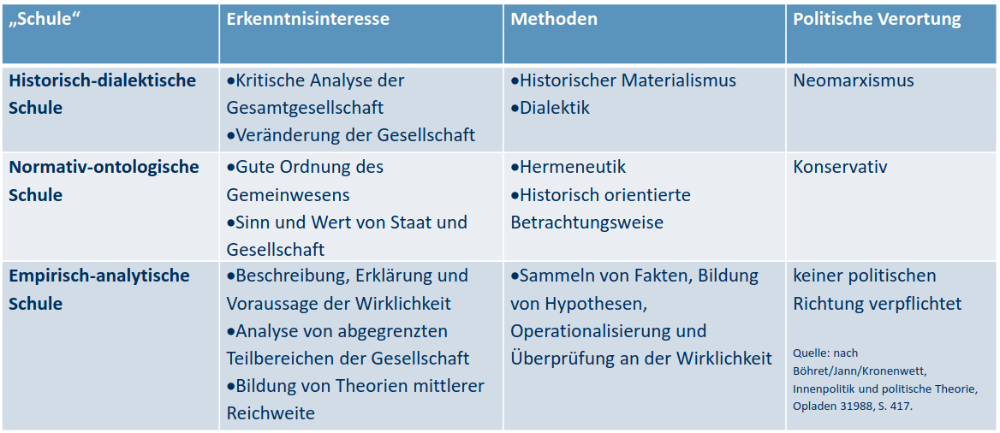

# Einführung Politikwissenschaften

## Formales

- Klausurtermin 08.02.2023 14-16 Uhr Carl-Zeiss-Str. 3, HS 1 (der letzte Mittwoch der Semesterzeit)
- Klausurformat single und multiple choice)
- Literaturempfehlung: Politische Theorie Jürgen Hartmann 2. Auflage (online Thulb)

## Was ist Politik? - Der Mensch als "zoon politikon" (Aristoteles)

„Wer aber nicht in Gemeinschaft leben kann oder in seiner Autarkie ihrer nicht bedarf, der
ist kein Teil des Staates, sondern ein wildes Tier oder Gott“ (Aristoteles, Politik,
herausgeg. von Olof Gigon, München 1971, 48 ff.)

| Gemeinschaft | Zweck/Gut der Gemeinschaft |
|--------------|------------------------------|
|Mann und Frau|Fortpflanzung und Arterhaltung|
|Haushalt|Wirtschaft und Pflege|
|Dorf|Arbeitsteilung und Kultur|
|Staat (Polis)|höchste Glückseligkeit (gutes Leben), Autarkie|

- ersten Gemeinschaften zum Überleben, spätere (insb. Polis) das gelungene Leben

### Erste Staatsformenlehre nach Aristoteles

|Zahl der Herrschenden|Zum gemeinsamen Nutzen|Zum Wohl der Herrschenden|
|---------------------|----------------------|-------------------------|
|Einer|Königtum|Tyrannis|
|Einige|Aristokratie|Oligarchie (Herrschaft der Reichen)|
|Alle, viele, die Menge|Politie|Demokratie (Herrschaft der Armen)|

### Das Politische bei Aristoteles ist

- das Streben nach dem höchsten Gut, der Glückseligkeit, die sich in der wohlorganisierten Polis verwirklichen
- alles Handeln der Bürger einer Polis, das deren Ordnung betrifft (Organisation von Herrschaft in Verfassungen und Gesetzen)

### Gegensatzpaare von Ulrich von Alemann

Fazit: Es gibt keinen einheitliche Politikbegriff, sondern eine wissenschaftliche
Konkurrenz unterschiedlicher Begriffe.

- gouvernemental (Staat, Führung, Macht, Hierarchie, Lenkung) <-> emanzipatorisch (Herrschaftskritik, Partizipation, Teilhabe)
- normativ (Wie sollte Politik sein?) <-> deskriptiv (Was ist Politik und wie läuft sie faktisch ab?)
- konfliktorientert (Pluralismus, Interessengegensätze) <-> konsensorientiert (Verständigung, gesellschaftlicher Zusammenhalt, gemeinsame Werte)

### Pragmatische Arbeitsdefinition der heutigen Politikwissenschaft

Politik ist jenes menschliche Handeln, das auf die Herstellung und Durchsetzung
allgemeinverbindlicher Regelungen und Entscheidungen (d.h. von ‚allgemeiner
Verbindlichkeit‘ ) in und zwischen Gruppen von Menschen abzielt“ - Patzelt, W. J., Einführung in die Politikwissenschaft. Grundriss des Faches und studienbegleitende Orientierung. Passau7 2013

|Bezeichnung|Erscheinungsform|Ziel|Dimension|
|-----------|----------------|----|---------|
|Polity|Verfassung, Normen/Gesetze, Institutionen|Ordnung|Form des Politischen|
|Policy|Konkrete Politikfelder, Aufgaben, Ziele|Gestaltung|Inhalt des Politischen|
|Politics|Interessen, Konflikte, Wettbewerb|Durchsetzung|Prozess des Politischen|

## Freiheit

Ein freier Mann ist derjenige, der mit seiner Kraft und dem, was er kann, nicht daran gehindert wird das zu tun was er will. - Hobbes

Aber: Das Zufriedener-Sklave-Problem: ein Sklave ohne eigene Wünsche ist zufrieden, wie es aktuell ist. Aber er ist nicht tatsächlich frei.

### Isaiah Berlin: Zwei Freiheitsbegriffe

- Negative Freiheit: Freiheit von... (z.B. nach Hobbes)
  - Abwesenheit von Zwang und Fremdbestimmung
  - in modernen Verfassungen in den „liberalen
Abwehrrechten“ kodifiziert
  - anfällig für Missbrauch: „Die Freiheit der Wölfe ist der Tod
der Lämmer.

- Positive Freiheit: Freiheit zur... (z.B. Rousseau)
  - Selbstbestimmung i. S. v. Beteiligung an den öffentlichen
Angelegenheiten (Gesetzgebung und der Wahl der Regierung)
  - in modernen Verfassungen in Mitwirkungsrechten kodifiziert
  - anfällig für Missbrauch: bei Festlegung der Qualität freier
Handlungen; „Einsicht in die Notwendigkeit“ (F. Engels);
Einschränkung von Wertepluralismus bis hin zur Rechtfertigung
des Totalitarismus

- Berlin ist für negative Freiheit

## Sicherheit

„Unter Sicherheit wird i. d. R. die Abwesenheit von (bzw. der Schutz vor) Gefahren und Bedrohungen verstanden“ Lutz, Dieter S. (1995): Art. Sicherheit/Internationale Sicherheitspolitik. In: Nohlen, D.: Wörterbuch Staat und Politik. Bonn: BpB.

- objektive vs. subjektive Sicherheit
- innere vs. äußere Sicherheit

## Macht

„Wer Politik treibt, erstrebt Macht: Macht entweder als Mittel im
Dienst anderer Ziele (idealer oder egoistischer) – oder Macht
»um ihrer selbst willen«: um das Prestigegefühl, das sie gibt,
zu genießen.“ Max Weber (1988): Politik als Beruf. In: Max Weber: Gesammelte Politische Schriften. Tübingen: Mohr, S. 507

„Macht bedeutet die Chance, innerhalb einer sozialen Beziehung
den eigenen Willen auch gegen Widerstreben durchzusetzen,
gleichviel, worauf diese Chance beruht.“ Max Weber: Wirtschaft und Gesellslchaft , 1, §1

### Chance, den eigenen Willen durchzusetzen

- asymmetrische Relation zwischen A und B: B würde ohne Bezug zu A nicht handeln, wie er es tut.
- Weshalb handelt B aber so: durch Erzwingungschance von A

### Machtressourcen

- Fähigkeit, Zwang oder Gewalt auszuüben
- Reichtum (Belohnen)
- Deutung oder Meinung (Medien)
- (zugeschriebene) Wertschätzung der Herrschaftsposition (Autorität)
- (zugeschriebenes) Wissen (Experten) oder besondere Fähigkeiten (z.B. Rhetorik)

### soziale (bzw. politische) Beziehungen

- soziale Gruppen (z. B. Parteien, Verbände) mit Machtrelationen
sowohl inner- wie außerhalb der Gruppen
- Staaten – ebenfalls mit Machtrelationen innerhalb eines Staates
wie auch zwischen Staaten
- Koalitionen von Staaten (Bündnisse)

## Gewalt

*STEHT NICHT AUF DER LISTE VON MAY *

- immer: physische Beeinträchtigung
- interpersonell: face-to-face-Situation
- institutionell: "Staatsgewalt", "legislative Gewalt", "exekutive Gewalt" ggü. Personen/ Gruppen
- strukturell: vermeidbare unmenschliche gesellschaftliche Verhältnisse

## Zur Verwobenheit von Freiheit, Sicherheit, Macht und Gewalt im Kontext des modernen Staates

### Was ist ein Staat?

Definition von Max Weber (1864-1929): „Staat ist diejenige menschliche Gemeinschaft, welche innerhalb eines
bestimmten Gebietes ... das Monopol legitimer physischer Gewaltsamkeit für sich (mit Erfolg) beansprucht.“

Staatsrechtliche Definition von Georg Jellinek (1851-1911): Staatsgebiet, Staatsgewalt, Staatsvolk

### Theorie nach Hobbes

- Wir brauchen einen Staat für Sicherheit
- fehlende Staatlichkeit bringt die Me in Naturzustand: jeder kann jeden vom Leben zum Tode befördern und somit Opfer von Gewalt werden
- Lösung: Staatsvertrag (Kontraktualismus), den alle mit allen zugunsten eines Dritten schließen!
- alle natürlichen Rechte auf einen Dritten übertragen, außer Recht auf Leben und Selbstverteidigung
- Ziel: der Dritte soll für Frieden und Sicherheit sorgen
- Leviathan

### Bewertung von Hobbes & seiner Theorie

- Denker der Aufklärung
- kein liberaler Denker -> Widerstandsrecht ausgeschlossen
- Vordenker des Autoritarismus
- Denker moderner Staatlichkeit und ein Begründer des staatlichen Gewaltmonopols als Voraussetzung für eine Rechtsordnung („auctoritas non veritas facit legem“), die wiederum die Bürger (voreinander) schützt

### Theorie nach Locke

- "Leben, Freiheit, Eigentum" -> dafür braucht es einen Staat
- Naturzustand ohne Geld ist "paradiesisch", Einführung des Geldes sorgt für einen Krieg aller gegen alle
- Naturzustand durch Verträge beenden: Gesellschafts- und Herrschaftsvertrag
- Erlangung von Life, Liberty, Property als unveräußerliche Naturrechte durch Staatlichkeit
- Unterschied zu Hobbes: gewaltenteilige Regierung statt Leviathan (gewählte Legislative, monarchische Exekutive)

### Bewertung von Locke & seiner Theorie

- Apologet des liberalen Besitzindividualismus
- Apologet = stellt voll und ganz hinter einer Theorie
- Vordenker des demokratischen Verfassungsstaates (Gewaltenteilung, Grundrechte, Parlamentarismus, Verantwortlichkeit, Widerstandsrecht)
  
### Spannungsverhältnis Sicherheit & Freiheit

- Wie viel Freiheit soll/ muss aufgegeben werden, um Sicherheit zu gewährleisten?
- Wie viel staatlich verbürgte Sicherheit soll/ muss aufgegeben werden, um Freiheit zu gewährleisten?
- Sind Freiheit und Sicherheit gleichzeitig zu haben?

### Gewalt von unten gegen staatliche Institutionen legitim?

- GG, Art. 20:
- (3) Die Gesetzgebung ist an die verfassungsmäßige Ordnung, die vollziehende Gewalt und die Rechtsprechung sind an Gesetz und Recht gebunden.
- (4) Gegen jeden, der es unternimmt, diese Ordnung zu beseitigen, haben alle Deutschen das Recht zum Widerstand, wenn andere Abhilfe nicht möglich ist.
- Ziviler Ungehorsam: bewusste symbolische Rechtsverletzungen um auf staatliche Misstände aufmerksam zu machen.
  - kann unter bestimmten Rahmenbedingungen legitim sein

## Vom Sicherheits- und Rechtsstaat (Sicherheit und Freiheit) zum Kampf um soziale Rechte (Solidarität)

*NICHT AUF DER LISTE VON MAY*

- am ursprünglichen (von Locke und Hobbes erdachten) Staatenkonstrukt entzündete sich ab dem 19. Jahrhundert sozialistische Kritik
- Bourgeoisie (Besitzer von Produktionsmitteln) und Proletariat (Arbeitskraft) als prägende Klassen des Kapitalismus
- Industrialisierung/ Soziale Frage entfachte Konflikt zw. formaler Gleichheit vor dem Gesetz (Bürgerrechte) und sozialer Ungleichheit der Klassen
- der liberale Sicherheits- und Rechtsstaat legitimiere und stabilisiere die soziale Ungleichheit
- Lösungsansätze: Klassenkampf, proletarische Revolution
  - Zwischenstufe einer Diktatur des Proletariats (geführt von einer „Vorhut“ der Arbeiterklasse), Abschaffung des Privateigentums an Produktionsmitteln und weiterer liberaler Freiheitsrechte

## Vom Klassenkampf zum pluralistischen Konflikt

### Marxistische Konflikttheorie

- Eigenschaft von Ausbeutergesellschaft
- dysfunktional für wirtschaftliche und menschliche Entwicklung
- Überwindung durch Revolution
- ... hin zu einer harmonische Gesellschaft (Reich der Freiheit, in dem kein Mensch über den anderen herrschen soll)

### liberal-pluralistische Konflikttheorie

- universelle Erscheinung
- funktional für die Entfaltung menschlicher und gesellschaftlicher Potenziale
- Einhegung als Sicherstellung eines gewaltlosen Austrags
- Kompromiss (wechselseitiges Entgegenkommen) oder Konsens (Übereinstimmung)

#### Konflikte und Konflikttypen

Streit oder Auseinandersetzungen zwischen widerstrebenden Personen oder Gruppen über unterschiedliche Interessen/Werte/Ziele/Strategien etc.

Bezugspunkt ist Konsens. Wie viel Konsens möglich/ nötig ist, ist Gegenstand polit. und wissenschaftl. Debatten.

- Ressourcen- und Verteilungskonflikte
- Organisationskonflikt (Mittel der Durchsetzung/ der Erzielung eines gewünschten Resultats)
- Ziel- und Wertekonflikte
  
## Der pluralistische Konflikt als Konflikt von Interessen

*NICHT AUF MAYS LISTE*

- Interesse als verhaltensorientiertes Ziel oder Bedürfnis von Einzelnen oder Gruppen in einem sozialen Umfeld
- Konflikte immer zwischen Interessengruppen
  - gegenüber anderen Gruppen mit abweichenden Interessen
  - Interessen der Gruppenmitgliedern durch Mitwirkung und Einwrkung auf Parlamente, Regierung, Öffentlichkeit
- Abgrenzung: Interessengruppen (Verbände) vs. Parteien vs. Vereine
- Kritikpunkte:
  - Marginalisierung bestimmter interessen
  - Legitimationsdefizit

### Interesse nach Patzelt

„Interesse ist „ein verhaltensorientiertes Ziel oder Bedürfnis von Einzelnen oder Gruppen in einem sozialen Umfeld, das zu erreichen bzw. zu befriedigen in irgendeiner für ihn wichtigen Weise das Wohlergehen eines Einzelnen oder eines Kollektivs fördern bzw. zu einem Vorteil führen würde.“

### Ziel und Bedürfnis/Nutzenorientierung

*NICHT AUF MAYS LISTE*

- ökonomisch, politisch, kulturell, ökologisch
- materiell und immateriell (z.B. moralisch)
- bewusst und unbewusst
- öffentlich und privat

### Verhalten

*NICHT AUF MAYS LISTE*

- Geltendmachung der Interessen
- Interessenaggregation
- Interessenselektion
- Interessenartikulation und Interessenvertretung

### Soziales Umfeld

*NICHT AUF MAYS LISTE*

- politische Rahmenbedingungen (z. B. Vereinigungsfreiheit in Art. 9 GG)
- gesellschaftliche Rahmenbedingungen (z. B. Optionen, konkurrierende Interessen)

## Konflikt und Interessen – Was ist und wo bleibt das Gemeinwohl?

Zentraler politikwissenschaftlicher Begriff: Gemeinwohl als das Wohl aller Mitglieder einer Gesellschaft (lat. bonum commune); allgemeiner Zweck, weswegen sich Menschen in einer politischen Aggregation zusammenschließen

Ernst Fraenkel und Parallelogramm der Kräfte:

- Wie kann in einer pluralistischen Demokratie trotz Partialinteressen ein Gesamtwille gebildet und ein Gemeinwohl gefördert werden?
- Gemeinwohl ist Ergebnis aus dem Parallelogramm der ökonomischen, sozialen, politischen und ideologischen Kräfte einer Nation, wenn Ausgleich angestrebt und erreicht wird, welcher objektiv Mindestanforderungen einer gerechten Sozialordnung entspricht und subjektiv von keiner Gruppe als "Vergewaltigung" empfunden wird

Gemeinwohl a posteriori statt a priori, d.h. kann nur im Nachhinein empfunden werden

## Demokratie und Legitimität

*NICHT AUF MAYS LISTE*

- Das Diktum von Abraham Lincoln: Demokratie sei "die Herrschaft
  - des Volkes,
  - durch das Volk und
  - für das Volk"
  - Verfahren nicht definiert, Volk hat eine besondere und keine passive Rolle

- Voraussetzung für die Demokratie (wie für jede andere Herrschaftsform): von den Herrschenden beanspruchte und den Berrschten entgegengebrachte Anerkennung der Herrschaftsform - die Legitimität

### Legitimitätsglaube & dessen Formen (nach Max Weber)

- Legale Herrschaft (z.B. Demokratie)
  - Kraft Satzung (Grundlage einer Satzung: formaler Akt der Herrschaftsverleihung, z.B. Wahlen)
  - Kompetenz (rational)
- Traditionelle Herrschaft (z.B. Monarchie)
  - Kraft Glaubens an die Heiligkeit der von jeher vorhandenen Ordnung und Herrengewalt
  - Privileg (ständisch, also kraft Eigenstellung)
- Charismatische Herrschaft (z.B. NS Zeit, Diktatur)
  - Kraft affektueller Hingabe an die Person des Herrn und ihre Gnadengabe (Charisma)
  - Sendung des Herrn (irrational)

- Legitimitätsglaube in Demokratie: Anerkennungswüridkgiet des Verfahrens, mit dem das Volk, durch das Volk über das Volk herrscht.

### Theorienlandschaft

- konkurrierende Konzepte und Theorien der Demokratie

- zwei Arten:
  - normative Theorien der Demokratie (Was macht Demokratie aus, warum ist sie anderen Regierungsformen überlegen)
  - Realistische/ empirische Theorien der Demokratie (was Demokratie ist und wie sie wirklich funktioniert)

### Merkmalsdimensionen des Demokratiebegriffes

*NICHT AUF MAYS LISTE*

- Unterscheidung Deskription und Präskription (keine klaren Grenzen), es braucht beide Definitionen
- demokratisches Ideal definiert nicht die Wirklichkeit und wird nie Wirklichkeit sein
- Demokratie aus den Wechselwirkungen zwischen ihren Idealen und ihrer Wirklichkeit entsteht und gestaltet wird

## Normative Demokratiekonzeptionen: Rousseau

*MAY EXPLIZIT: EINE DETAILLIERTE KENNTNIS NICHT VERLANGT, UNTERSCHIEDE THEORIEFAMILIEN WICHTIGER*

1. Bürger

   - aktive Bürger, nehmen an Herrschaftsprozess teil
   - Bürger sind gleichzeitig Regierende und Regierte (Identität)
   - radikale Volkssouveränität, d.h. Me regieren sich selbst und geben Herrschaft nicht ab
   - intensive Partizipation

2. Rechtsverständnis

   - Rechtsordnung geht aus der Volkssouveränität hervor
  
3. Politischer Prozess und Willensbildung

   - Sonderwille, Gesamtwille und Gemeinwille
     - Sonderwille: individueller Wille
     - Gesamtwille: Mehrheitsentscheidung
     - Gemeinwille: was an allen Sonderwillen verallgemeinbar ist (theoretisches Vernunftskonstrukt)
     - Regierende müssen über Gemeinwillen aufklären und diesen finden
   - direkte Demokratie (Gesetzgebung)
   - keine Gewaltenteilung
   - keine Fraktionen
   - keine Repräsentation
   - keine Trennung von Staat und Gesellschaft

- Rousseau vertritt positiven Freiheitsbegriff
  
## Realistische Demokratiekonzeptionen: Schumpeter

*MAY EXPLIZIT: EINE DETAILLIERTE KENNTNIS NICHT VERLANGT, UNTERSCHIEDE THEORIEFAMILIEN WICHTIGER*

1. Bürger

   - Konsumenten, verführbar, der Führung bedürftig
   - nur bei eigenen Interessen rational, sonst irrational
   - der mündige Bürger als Illusion; man kommt an den Massen aber nicht mehr vorbei
   - "jegliche Herrschaft ist Elitenherrschaft"

2. Rechtsverständnis

   - Unterbetonung von Rechtsstaatlichkeit und rechtlichen Grenzen
   - Gesetze und Verordnungen als Nebenprodukt des politischen Prozesses

3. Politischer Prozess und Willensbildung

   - Mobilisierung/Erwerb von Wählerstimmen – politische Produkte gegen Wählerstimmen
   - große Bedeutung politischer Führung
   - Unterbetonung von Vermittlungsinstanzen
   - Demokratie: Prozess ohne Eigenwert, rein als Methode um Herrschaft zu finden
  
## Realistische Demokratiekonzeptionen: Dahl

Es gibt eine Idealdemokratie und eine Polyarchie als Vermittlungsversuch normativer und realistischer Ansätze

### Idealdemokratie

- effektive Partizipation, d.h. mögl. alle entscheiden alles
- Gleichheit beim Wählen/Entscheiden
- Kenntnis aller relevanten Informationen
- volle Bestimmung der politischen Agenda durch die Bürger
- Einbeziehung aller mündigen Erwachsenen

### Polyarchie (als mögliche Demokratie in komplexen Gesellschaften)

Demokratie benötigt

- gewählte Amtsträger
- freie, faire, regelmäßige Wahlen
- Rede- und Meinungsfreiheit, Pressefreiheit
- Vereinigungsfreiheit
- letztinstanzliche Kontrolle über die politische Agenda
- Einbeziehung aller mündigen Erwachsenen (soweit möglich)

## Die Anfänge der Politiklehre an den mittelalterlichen Universitäten (13.-15. Jh.)

- Rückgriff auf antike Traditionen (v. a. Aristoteles)
  - Polis als etymologischer Ursprung des Politikbegriffes
  - Mensch als "zoon politikon"
  - Staatsformenlehre

### Verbindung der antiken Tradition mit christl. Herrschaftsvorstellungen

- (Thomas von Aquin übersetzt sämtliche Werke des Aristoteles ins Lateinische, Tradition der Aristoteles-Kommentare)
- Anerkennung des Gemeinschaftscharakters des Menschen, aber: Notwendigkeit einer Leitung, weil die Pluralität der menschlichen Zwecke dies verlangt
- Ablehnung Aristokratie (Streit), Befürwortung Monarchie ("natürliche Herrschaftsform", Geist-Körper-Analogie)
- Gütekriterium monarchischer Herrschaft: Orientierung an Gott

### Praktische Anwendung: Fürstenspiegel-Literatur

- Politikberatung: Mahnung und Hinweise an Herrschende
- Regierungsweise, politisches Verhalten, Erziehung des Nachwuchses

## Frühneuzeitlicher Staat und Auffächerung der Staatswissenschaften (16.-18. Jh.)

### Konflikte der Zeit

*GROB*

- Reformation -> Konflikt zw. Kaiser und Reichsstände
  - Konfliktlinie: Deutschen Könige und Kaiser vs. Reichsfürsten (Eigenständigkeit der Reichsfürsten)
  - Augsburger Religionsfriede 1555
- Dreißigjähriger Krieg -> Staatenbildungskrieg, Souveränität der Reichsfürsten (gegenüber der Zentralmacht, aber auch den Landständen)
  - 1648 Westfälischer Friede: Bestätigung des Augsburger Religionsfriedens unter Hinzunahme der ‚Reformierten‘
- Heilige Römische Reich deutscher Nationen als zentraler Akteur

### Adressaten der Politikwissenschaft

- Fürsten, aufgeklärtes Bürgertum: Fürstenspiegel
- Beamte: Reformierung als wesentliche Träge staatlichen Handelns
  - PoWi war dafür da Beamte auszubilden, der Praxisbezug war neu -> Kameralwissenschaften

### Themen der Politikwissenschaft

- Abstrakte Staatstheorie: Macht, Herrschaft, Staat, Souveränität, Heil, Widerstand, Ehrlichkeit, Lüge (wie Hobbes, Locke, Machiavelli)
- Praxisbezug und Politikberatung: konkrete "kleinkarierte" (Bleek) Verwaltungstechniken des Machterwerbs und Machterhalts, aber auch Entwicklung unterschiedlicher Politikfelder ("Policey"), v.a. ab 17. Jh.

### Niccolo Machiavelli als Techniker der Macht und Ratgeber des Fürsten

- ToDo (Folie 11, VL5)

### Studiengänge für Kameralwissenschaft im 18. Jh. in Halle und Frankfurt/Oder für den preußischen Absolutismus

- Professoren: praxiserfahrene Gelehrte
- Sujet (Gegenstand) der Professoren: Kameralistische Lehrbücher

### Politikwissenschaft als Studienfach für Staatsbeamte des neuzeitlich-absolutistischen Territorialstaates (Kameralwissenschaft)

*GROB*

- Polizeiwissenschaft ("Policey"): politische Themenfelder zum Zustand einer guten Ordnung eines städtischen oder territorialen Gemeinwesens (z.B. Kriminal- und Strafrechtswesen, Zenurs, Verwaltung, Wirtschaftspolitik -> Merkantilismus)
  - Merkantilismus aktive Wirtschaftspolitik des Staates, Zölle auf fertig importierte Produkte, unverarbeitetes günstiger
- Ökonomik: verzahnt mit Polizeiwissenschaften
  - Schwerpunkt neben Staat als Hauswirtschaft des Fürsten auch Familienwirtschaft
  - Hausvater als "Fürst der Familie" (noch keine Trennung von Familie und Wirtschaft)
  - Familie (familia) als Personenverbund des Hauses
- Kameralistik: verzahnt mit Polizeiwissenschaften
  - Lehre von der Vermehrung des Vermögens der Obrigkeit
  - v.a. Steuer- und Finanzsystem, Buchhaltung, Pflege von Bergbau, Forsten, Straßen, Kanälen, Staatsbetrieb

## Politische Wissenschaft im Preußen des 19. Jahrhundert

### Historischer Kontext

*GROB*

- Ende des Ancien Régime (franz. Revolution)
- Napoleonische Besatzung, Ende des Heiligen Römischen Reiches Deutscher Nation und Gründung des Rheinbundes
(1806)
- Völkerschlacht Leipzig (1813), Wiener Kongress und Deutscher Bund (1815), Heilige Allianz (1815) - Restauration
- Wartburgfest (1817), Hambacher Fest (1832) - Gegenbewegung

### Napoleonische Zeit als Impuls für inhaltliche Kontroversen: Diskussion um Verfassung am Beispiel Dahlmann/Stahl

*GROB*

- Diskussion über: Stellung des Monarchens und des Parlaments, sowie die Freiheit und Grundrechte der Bürger
- Friedrich Christoph Dahlmann
  - starke Stellung des Monarchen mit Vetorecht, 2 Kammern Parlamente (Gesetzes- und Budgetrecht) -> klar an Regeln der Verfassung gebunden
  - konst. Monarchie (Schwerpunkt auf Konstitution = Verfassung)
  - Reform
  - liberal
  - Rationalismus (Vertragsdenken)
- Julias Stahl
  - Monarch muss Verfassung achten, aber Staat keine Vertragskonstruktion sondern als Institution die von Gott eingesetzt wurde -> stärkere Rechte des Monarchen (Initiativ- und Budgetrecht, (nicht) Einberufung Volksvertretung)
  - Volksvertretung dient der Zustimmung des Monarchen
  - Monarchen soll Interesse des Staates und Gemeinwesens im Fokus haben, nicht die eigenen
  - konst. Monarchie (Schwerpunkt auf Monarchie)
  - Tradition
  - konservativ (in dem Fall eher monarchistisch)
  - Religion (Staat ist von Gott eingesetzte Institution)

### Napoleonische Zeit als Impuls für Studienreformen (in Preußen nach Niederlagen Napoleons 1813, 1815)

- Schlüsselrolle Wilhelm von Humboldts als "Kulturminister" in Preußen
- Reaktion auf Krise der Uni und Krise des Kameralismus
  - Uni war v.a. Ort der Vermittelung von Glaubensgrundsätzen
  - Kameralismus als umfassende Steuerungswissenschaft der Obrigkeit widersprach Individualismus und Aufklärung
- Abwendung von Absolutismus und Kameralismus als "Reform von oben"
- Hinwendung zur "zweckfreien Suche nach wissenschaftlicher Wahrheit"

- Grund: Staatsbeamte mit Einsicht und Weitblick, nicht lediglich Ausführungsorgane, Allgemeinbildung statt Spezialbildung, politische Philosophie statt "Brotstudien"

- Mitte 19. Jh. keine alleinstehende Politikwissenschaft mehr vorhanden

## Weimarer Republik und NS

### Gründungssituation

*GROB*

- Ende 1. WK
- 1918: Revolution, Abdankung Kaiser, Ausrufung Republik
- 1918-1919: Republiken Österreich, Tschechoslowakei, Ungarn
- Feb. 1919- Mai 1920: Verfassungsgebende deutsche Nationalversammlung (Weimar)
- 28.06.1919: Versailler Vertrag
- 1920: erste reguläre Wahl zum Reichstag

### Weimarer Staatsrechtsdebatte

*BESONDERS RELEVANT*

- Hans Kelsen
  - Dominanz der Rechtsnorm
  - Recht konstituiert Ordnung
  - Vernachlässigung des materiellen Rechtsinhalts (Verfahren sind wichtiger)
  - Recht dominiert die Politik
  - Verfassungsgericht
  
- Carl Schmitt
  - legitimierte NS Politik
  - Dominanz der politische Entscheidung
  - Politik konstituiert Ordnung
  - Dominanz des materiellen Rechtsinhalts
  - Politik nutzt das Recht nur als Mittel (der "Feindbekämpfung"), Verfassung/ Rechtsnorm kommt danach
  - politische Entscheidungsträger
  
### Deutsche Hochschule für Politik als Keimzelle der deutschen Politikwissenschaft (gegr. 1920)

- Unterstützung für neu gegründete Demokratie
- akademische und nicht-akademische Ausbildungsgänge
- Curriculum (Lehrplan): Allgemeine Politik, Politische Geschichte und Politische Soziologie, Außenpolitik und Auslandskunde, Innenpolitik, Recht, Wirtschaftspolitik - später weitere Spezialisierungen

ab 1933:

- verlängerter Arm der NS Diktatur, gelenkt von einem Kommissar aus dem Reichspropagandaministerium
- Umwälzung Lehrpersonal
- Umwälzung Lehrinhalt (Propaganda, Wehrpolitik, Rassenkunde, Feinderkundung, Siedlungspolitik)
- Schulungszentrum für NSDAP-"Führernachwuchs"

ab 1948:

- von verfolgten Wissenschaftlern neu gegründet
- 1959 in FU Berlin eingegliedert
  
#### Zeitumbruch Weimarer Republik zu NS Diktatur

- 30.01.1933: Ernennung Hitlers als Reichskanzler
- 1933: Ermächtigungsgesetze
- 1935: "Nürnberger Gesetze"
- 9./19.11.1938: Progrome gegen Juden
- 01.09.1939-08.05.1945: Zweiter Weltkrieg

## Demokratiewissenschaft – Orientierung in den 40er und 50er Jahren

### Motive für die Einrichtung politikwissenschaftlicher Institute und Studiengänge

- Ursachen des NS als Erziehungsproblem interpretiert (dt. Volk hat Untertanengeist, auf Hierarchien und Autoritäten fußendes Staatsverhältnis)
- Adorno "Studien zum autoritären Charakter" - drei Charaktereigenschaften:
  - Wille zur Unterwerfung
  - Demütigung nach Unten
  - Konventionalismus

- NS ist ein Mentalitätsproblem -> Bildung und Erziehung benötigt
- Politikwissenschaften als Demokratiewissenschaften

### Maßnahmen zur Einführung einer deutschen Politikwissenschaft an den Universitäten

- Konferenz 1949: „Einführung der politischen Wissenschaften an den deutschen Universitäten und Hochschulen“ (hessisches Staatsministerium und amerikanische Militäradministration)
- Widerstände durch Juristen und Historiker
- schnelle Einführung aufgrund des politischen Willens
- zur Etablierung benötigt:
  - Professoren und Institute
  - Fachverbände - DVPW 1951, DGfP 1983
  - Fachzeitschriften

### Fachzeitschriften

Frühe Fachzeitschriften:

- Zeitschrift für Politik (ZfP), ab 1954
- Politische Vierteljahresschrift (PVS), ab 1960
  
Weitere Fachzeitschriften:

- Zeitschrift für Politikwissenschaft
- Zeitschrift für internationale Beziehungen
- Wikipedia zählt 49 deutsche politikwissenschaftliche Fachzeitschriften auf

## Ausdifferenzierung der Politikwissenschaft seit den 60er Jahren

### Ausdifferenzierung in die 5 klassischen Teildisziplinen des Fachs

- Politische Theorie und Ideengeschichte
- Politisches System der Bundesrepublik
- Internationale Beziehungen
- Vergleichende Politikwissenschaft
- Didaktik der Politik (ab 60er Jahre)

### „Schulenbildung“

- normativ-ontologisch
- emprisch-analytisch
- kritisch-dialektisch
  
#### normativ-ontologisch

- Suche nach dem Wesen des Menschens (nach Aristoteles), Seins-Ordnung feststellen um Prinzipien guter politischer Ordnung abzuleiten
- Theoretisches Reflektieren und Nachdenken
- z.B. "Warum sind Parteien sinnvoll?" -> Pluralität der Interessen & Naturrechte Me müssen sich zusammenfinden können

#### emprisch-analytisch

- Wie funktioniert Politik? Wie ist die politische Ordnung? Wie funktioniert sie?
- Beobachtung, Erhebung, Interpretation & Auswertung von Daten
- zwei Arten:
    1. induktiv: Einzelfall analysieren und danach Suche nach weiteren Fällen
    2. deduktiv: Theorie und danach passende Fälle suchen
- z.B. "Warum gewinnen Parteien Wahlen?" -> deduktiv, d.h. Theorie "Parteien gewinnen Wahlen, wenn..." und jetzt Einzelfälle suchen (z.B. Redeanalyse, Wahlprogramme)

#### kritisch-dialektisch

- geht von einer Kritik an normativ-ontologisch und empirisch-analytisch aus
- beide beschreiben die Welt, so wie sie ist & geht nicht davon aus, dass es vom Me gemacht ist -> kein Blick auf die Zukunft, verfestigt Gegebenes
- z.B. "Wie erklärt man die Existenz von Parteien unter einem marixistischer Konflikttheorie Blickwinkel?" -> Parteien als bürgerl. kapitalistisches Konstrukt angesehen

### Einflussreich für die Diskussion seit den 60er Jahren: Der Positivismusstreit

- Ursprung Soziologie, Einfluss auf PoWi
- Debatte zwischen emprisch-analytischen und kritisch-dialektischen Zugängen
- Charles Merriam: "behavioral revolution"
  - Etablierung der Politikwissenschaft als empirische Sozialwissenschaft – orientiert an den Naturwissenschaften
  - als OB-Kandidat: "Warum hab ich die Wahl verloren?" -> deskriptive Verhaltens- und Verhandlungsforschung, Beobachtung der Realität

- Kritik von Theodor W. Adorno
  - "Frankfurter Schule" -> Abwendung Empirismus

#### Ergebnis Positivismusstreit (Heute)

- PoWi als empirische Sozialwissenschaft
- meist in Fakultäten für Sozialwissenschaft, Sozial- und Verhaltenswissenschaften etc. (nicht mehr Geisteswissenschaft)

#### Merkmale behavioral revolution

- Theoriegeleitetheit der Forschung
- Suche nach Regelmäßigkeiten
- Nachprüfbarkeit und Objektivität
- Trend zur Quantifizierung
- Steuerbarkeit
- Beispiel: Wählerforschung

#### Merkmale behavioral revolution am Bsp. "Parteien müssen Wähler der Mitte ansprechen"

- Theoriegeleitetheit der Forschung - "Parteien müssen Wähler der Mitte ansprechen"
- Suche nach Regelmäßigkeiten - Wahlprogramme, Reden
- Nachprüfbarkeit und Objektivität - Forscher müssen bei gleicher Ausgangslage zu ähnlichen Ergebnissen kommen
- Trend zur Quantifizierung - Korrelationswert der Programme & Wahlergebnisse
- Steuerbarkeit - man erhält, was gemacht werden muss um Wahlen zu gewinnen
  
## Entwicklung der Politikwissenschaft seit den 80er Jahren

*NICHT IN MAYS LISTE*

- *Entspannung* der politischen Konflikte im Fach (von Ausnahmen abgesehen)
- *Professionalisierung* (Diskussion um das Berufsbild; Lehrerausbildung; method. Standards einer modernen Sozialwissenschaft; Politikberatung)
- *Spezialisierung* (Studiengänge, DVPW heute mit 10 Sektionen, 24 Arbeitskreisen, 10 Themengruppen: www.dvpw.de)
- *Internationalisierung* (z. B. durch EU-geförderte Forschungszusammenarbeit u. student. Mobilität)

## Wissenschaft - eine Definition von W. Patzelt

- zwei Differenzmarkierungen:
  - wissenschaftliche Aussagen & Aussagen des gesunden Menschenverstands
  - empirische & logische Aspekte des Wahrheitsgehaltes

### Differenzmarkierung wissenschaftliches und alltägliches Wissen

- Alltagswissen:
  - implizit-selbstverständlich (Selbstverständlichkeiten, nicht zu hinterfragen, z.B. Verkehrsunfall)
  - unreflektiert perspektivisch (Standpunkte) (Fokus auf das, was Medien bspw. aufgreifen)
  - unreflektiert selektiv (andere Einflüsse nicht erkannt)
  
- wissenschaftliches Wissen:
  - explizit-problematisierend (Vorausurteile vorsichtiger formuliert, zurückhaltend)
  - reflektiert perspektivisch (Sehpunkte) (Einschränkungen des Blickwinkels bewusst sein)
  - reflektiert selektiv (andere Einflüsse sind bekannt, Auslassungen werden zumindest benannt)

### Differenzmarkierung empirische & logische Aspekte des Wahrheitsgehaltes

- empirischer Wahrheitsgehalt
  - Übereinstimmung mit der Realität, empirische Triftigkeit:
    - Der Kanzler besitzt laut GG Richtlinienkompetenz
- logischer Wahrheitsgehalt
  - widerspruchslose, gültige Schlussform:
    - Alle F sind H
    - X ist F
    - X ist H
  - Vorsicht: Mit logisch ungültigen (falschen) Schlussregeln, kann man mit wahren Prämissen zu wahren und falschen Konklusionen kommen.
  
### deskriptive und normative Aussagen

- fehlt in Patzelts Definition
- deskriptiv: Ist-Aussagen
- normativ: Soll-Aussagen (sind hierbei überhaupt "wahre" Aussagen zu treffen? -> Bsp. Weber spricht dagegen, Kant dafür)

### Typen (politik-) wissenschaftlicher Sätze/ Aussagen

1. Beschreibungen
2. Wenn-dann-Aussagen
3. Erklärungen
4. Prognosen
5. Werturteile
6. Handlungsanweisungen

- Mit normativem und deskriptivem Gehalt und empirischem wie logischem Wahrheits- bzw. Geltungsanspruch

### Wahrheitsbegriff von Wissenschaft

- Fallibilität: da Wissenschaft von fehlbaren Menschen betrieben wird, gibt es keine "endgültige, unfehlbare" Wahrheit
- Prosesshaftigkeit: Annäherung an Wahrheit als leitendes Ideal
- Diskursivität: Überprüfbarkeit von Aussagen
- Karl Popper: Objektivität liegt vor, wenn sie intersubjektiv nachprüfbar ist

## Spielregeln der Wissenschaft

Falibilität, Prosesshaftigkeit, Diskursivität:

- wissenschaftliche Diskussion (d.h. Publikation d. Ergebnisse);
- wissenschaftliche Kritik und Korrektur (Prozesshaftigkeit!);
- Offenlegung der Quellen und der Methoden d. Datenerhebung u. -analyse;
- Querverweise auf abweichende wissenschaftl. Ergebnisse u. ggf. argumentative Auseinandersetzung damit;

Kritikfähigkeit:

- keine Immunisierung gegen Kritik etwa durch Bezug auf "Autoritäten" u. "Klassiker;
- undeutliche Sprache vermeiden, die die eigentl. Argumentation mehr verschleiert als deutlich macht u. es dem Wissenschaftler erlaubt, Kritik als "falsches Verständnis" zu denunzieren.

Charakter wissenschaftlicher Aussagen repräsentieren (explizit-problematisierend, reflektiert perspektivisch (Sehpunkte) und reflektiert selektiv):

- Offenlegung d. grundlegenden wissenschaftstheoret. Annahmen u. der erkenntnisleitenden Interessen

## Wissenschaftsmethodische Schulen

## Definitionen

- *Nominaldefinitionen:* Zuweisung eines bekannten Begriffs (definiens) zu einem unbekannten (definiendum)
- *Operationale Definitionen:* Zuweisung von empirischen Referenten zu Begriffen

- *Theorien:* Vernetzung von Aussagen zu einem komplexen Aussagegefüge (Theorie der Gewaltenteilung)
- *Modell:* verdichtete Kurzfassungen von Theorien

- wissenschaftlicher Prozess, Indikatoren etc. sind nie endgültig, "nichts Absolutes"

### Definitionen am Bsp. rechtsextremistische Einstellungen

- *Definiendum* (zu definierender Begriff) - rechtsextremistische Einstellungen
- *Definiens* (das Definierende) rechtsextremistischer Einstellungen nach "Konsensdefinition"
  - Affinität zu rechtsautoritären Regierungsformen
  - chauvinistische Einstellungen (hinzukommend: Definition Chauvinismus -> Kette von Definitionen)
  - Verharmlosung/Rechtfertigung des NS
  - ...

- *Operationale Definition* - für "Affinität zu rechtsautoritärer Regierungsform"
  - Indikatoren (empirische Referenten): Grad der Zustimmung zu bestimmten Aussagen (aus Fragebögen), z.B. "Wir sollten einen Führer haben, der Deutschland zum Wohle aller mit starker Hand regiert"
  - ab überwiegende Zustimmung, Zuordnung zu rechtsextremistischer Einstellung

## Was ist eine Theorie?

*NICHT IN MAYS LISTE*

Fragen an die Welt, z.B.

- Wie entsteht Terrorismus?
- Weshalb gibt es Armut auf der Welt?

Kurzdefinition:
Verknüpfung von Aussagen (über die Welt) zu einem komplexen Aussagengefüge

### Wie funktioniert Theoriebildung?

*NICHT IN MAYS LISTE*

- *Induktiv* Ausgangspunkt sind einzelne Tatsachenaussagen und konkrete Zusammenhänge, die zu einem Aussage- /Erklärungszusammenhang verknüpft werden (Beispiel: Parteien artikulieren den Willen ihrer Mitglieder an die politischen Entscheidungsträger und die Bürger)
- *Deduktiv* Ausgangspunkt sind relativ allgemeine Aussagen, deren Argumentation systematisch weitergeführt, erweitert und geprüft wird (Beispiel: Responsivität ist zentraler Bestandteil der Demokratie)

### Das Verhältnis von Theorien zur empirischen Forschung

- Einerseits stellen sie Begriffe, Definitionen, Argumentationen, Denkmuster bereit, die Datenerhebung (Operationalisierung) u. Datenauswertung bzw. - interpretation anleiten
- Andererseits werden Theorien durch die Ergebnisse empirischer Forschung überprüft u. ggfs. falsifiziert (widerlegen) oder verifiziert (bestätigen)

### Poppers Falsifikationismus

- *Vorgehen:* Wissenschaftler stellt Vermutungen auf, die überprüft werden; finden sie Bestätigung, dann werden sie vorläufig akzeptiert, finden sie Widerlegung, müssen sie fallengelassen werden
- *Beispiel:* Die Beobachtung eines schwarzen Schwans falsifiziert die Hypothese ein für alle mal, dass alle Schwäne weiß sind
- *Fazit:* Beobachtungen können Wahrheit nie finden, aber die Falschheit von Aussagen

- Absolute, endgültige Wahrheit werden wir nie finden, können nur Teile ausschließen

### Zum Erkenntniswert von Theorien

- Theorien, soweit sie nicht falsifiziert sind, haben eine Entsprechung in der Realität
- Theorien konstituieren auch ihren Gegenstand (die Realität)

### Reicht eine einzige Theorie, um ein Phänomen zu erklären?

- Pluralismus von Theorien!
- Es braucht mehr als eine Theorie um ein Phänomen zu erklären
- Patzelt: Metapher des Scheinwerfers (Art, Anzahl, Farbe)
