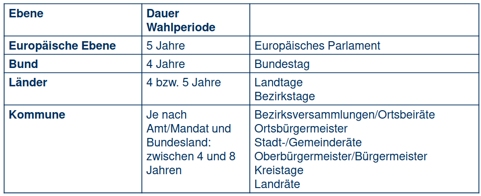
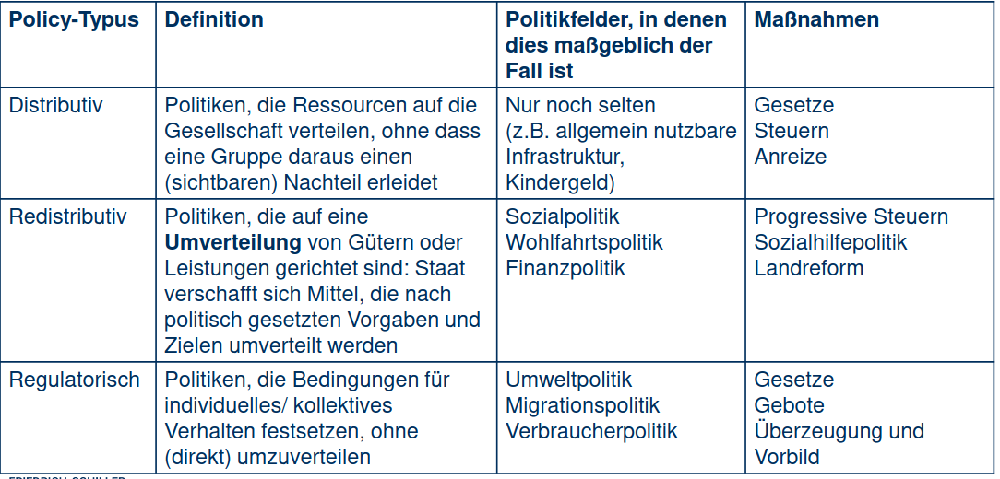
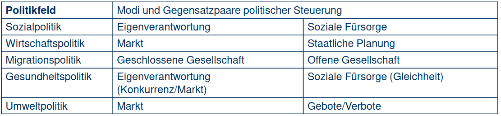
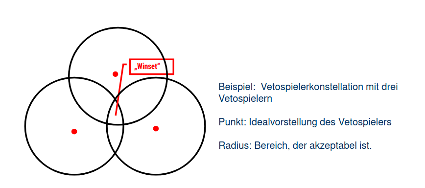

# Einführung in das politische System der BRD

## Bezugspunkte der Politk

- Unterscheidungen können sowohl normativ, als auch in der Begriffsdefinition getroffen werden
=> Kampf um die Deutungshoheit bestimmter Begriffe
- Ziel: Herstellung allgemein verbindlicher Regeln und Entscheidungen

## Systematisierung des Politikbegriffs

- Enges oder weites Verständnis
=> Abstufungen: Politik ist auf die staatliche Ebene begrenzt > Politik bezieht sich auf öffentliche Angelegenheiten > Politik findet überall dort statt, wo Macht ausgeübt wird

### Dimensionen der Politik

1. Polity (Politische Strukturen, Institutionenorientiert)
2. Politics (Politische Prozesse und Akteure, konkrete Politikfelder, Input- und Gestaltungsorientiert)
3. Policy (Politikinhalte in den Politikfeldern, Outputorientiert)

- der Fokus liegt auf einer Dimension, Überschneidungen möglich
- das politische System unterliegt einem weiten Verständnis, das Regierungssystem ist enger gefasst und vordergründig auf die Institutionen fokussiert

## Zentrale Grundbegriffe und Strukturprinzipien der Verfassung

- Artikel 20 GG: enthält entscheidende Strukturprinzipien unserer Verfassung
=> demokratischer und sozialer Bundesstaat
- die Staatsgewalt geht vom Volk aus (durch Wahlen und Abstimmungen)
=> weiterhin kann die Staatsgewalt durch die Legislative, Exekutive und Judikative ausgeübt werden (Absatz Zwei)
- Bindung der Legislative an die verfassungsmäßige Ordnung
- die Exekutive und die Judikative sind an Gesetz und Recht gebunden

## Strukturprinzip Demokratie

=> Aufschlüsselung des Demokratiebegriffes (Volkssouveränität, Mehrheitsprinzip mit Minderheitenschutz und Repräsentation)

- Artikel 79: Garant für die wehrhafte Demokratie
=> Änderungen des Grundgesetzes bedürfen einer 2/3-Mehrheit im Bundestag, Ewigkeitsklausel nach Absatz Drei

## Strukturprinzip Bundesstaat

- Bundesstaatlichkeit/Föderalismus
=> kein Einheits- oder Zentralstaat (Lehren aus den Schwächen der Weimarer Republik)
- Positive Aspekte:

1. Verhindert Machtkonzentration
2. Mehr politische Beteiligung
3. Reformfreudigkeit und politischer Wettbewerb
=> Chancen der Opposition

- Negative Aspekte:

1. Verkomplizierte Beziehung zwischen dem Bund und den Ländern
2. Lange Entscheidungswege im Gesetzgebungsprozess

=> Politikblockaden möglich (siehe Bundesrat)

1. Ungleiche Lebensverhältnisse in den Ländern (siehe z.B. Bildungspolitik)
2. Finanzieller Mehraufwand

## Strukturprinzip Rechtsstaat

- Rechtsstaatlichkeit
=> Staatliche Rechtsbindung, Gewährleistung der Verfassungsmäßigkeit
=> Abwehrrechte der Bürger: Rechtsweggarantie und unabhängige Gerichte
=> Rechtsgleichheit der Subjekte, Schutz der Grundrechte eines Jeden

## Strukturprinzip Sozialstaat

- Sozialstaatlichkeit
- nicht einklagbar, kein subjektives Recht, Handlungsauftrag an die Politik
=> die Ausgestaltung dieses Prinzips ist Teil des politischen Wettbewerbes (entsprechende Schwerpunktsetzung in der Sozialpolitik)
- die Grundrechte garantieren ein staatlich zu sicherndes Existenzminimum

## Gliederung der Verfassungsorgane

- Legislative: Bundestag, Bundesrat und Landtage
- Exekutive: Bundespräsident, Bundesregierung und Landesregierungen
- Judikative: Bundesverfassungsgericht
- Organ eigener Art: Bundesversammlung (einzige Aufgabe: Wahl des Bundespräsidenten

## Institutionengefüge

## Differenzierung zwischen parlamentarischer und präsidentieller Demokratie

=> Typologie der Regierungssysteme nach Steffani

- Primäres Merkmal des Parlamentarischen Systems: Regierung kann abberufen werden
- Gewaltenverschränkung
=> geht einher mit dem Neuen Dualismus (Opposition vs. Regierung)

## Konsens- und Mehrheitsdemokratien

- Unterscheidung zwischen Konsens- und Mehrheitsdemokratien nach Lijphart
=> Entscheidungskriterium: Ist in den politischen Entscheidungsstrukturen eines demokratischen Systems die Unterstützung oder aber die Einschränkung der Mehrheitsherrschaft angelegt?

## Willensbildung und Gesetzgebung: Der Deutsche Bundestag

### Rechtlicher Rahmen

- Grundgesetz: gibt grundlegende Vorgaben für die Wahlen zum Deutschen Bundestag, legt die Grundzüge der Organisation fest
- Geschäftsordnung: regelt detailliert Organisation und Arbeitsweise des Parlaments
- Abgeordnetengesetz: legt Rechte und Pflichten der Bundestagsabgeordneten fest
=> Garantie der freie Mandatsausübung, Regelung der Leistungsansprüche
- Parteiengesetz: regelt die Rechte der politischen Parteien, Vorgaben zur demokratischen Struktur und Parteienfinanzierung
- Bundeswahlgesetz: regelt das Wahlrecht und die Besonderheiten der Wahl zum Bundestag
- Untersuchungsausschussgesetz: Untersuchungsausschüsse prüfen vordergründig mögliche Missstände in Regierung und Verwaltung, sowie mögliches Fehlverhalten von Politikern

### Struktur und Organisation des Bundestages

- Definition Enquete-Kommission: Vorbereitung/Aufarbeitung komplexer Fragen

Gliederung:

1. Selbstorganisation des obersten Verfassungsorgans
   - Eigene Geschäftsordnung (Art. 40 GG)
2. Präsident, Präsidium und Ältestenrat
   - Gewählt durch das Plenum
   - Präsident vertritt den Bundestag und regelt seine Geschäfte, Hausrecht und Polizeigewalt (Art. 40 GG)
   - Präsident*in ist traditionell Mitglied der stärksten Fraktion, je ein/e Stellvertreter/in pro Fraktion
   - Abweichungen möglich, siehe AFD-Vizepräsidentschaft
   - Ältestenrat nach Fraktionsstärken zusammengesetzt (Präsidium plus 23 Abgeordnete)
3. Fraktionen als parteipolitische parlamentarische Einheiten
   - entsenden Mitglieder in die Ausschüsse
   - teilen sich in Regierungs- und Oppositionsfraktionen auf

### Ausschüsse

sind fachliche Arbeitseinheiten

- Ständige Ausschüsse analog zu Regierungsressorts/Ministerien gegliedert (weitere Ausschüsse zu spezifischen Themen)
  - besetzt gemäß des Stärkeverhältnisses der Fraktionen
  - in jeder Wahlperiode neu benannt und besetzt
- grundgesetzlich vorgeschriebene Ausschüsse: z.B. Petitionsausschuss
- Sonder- und Unterausschüsse
- Aufgaben:
  - Fachliche Vorbereitung von Beschlüssen
  - nach erster Lesung im Plenum werden Gesetzentwürfe an die betreffenden Fachausschüsse zur Beratung überwiesen
  - können auf eigene Initiative hin tätig werden
  - können öffentliche Anhörungen von Interessensverbänden, -vertretern und Experten durchführen
  - tagen i.d.R. nicht-öffentlich, können aber entscheiden, öffentlich zu tagen

### Weitere Gremien

1. Parlamentarische Kontrollgremium
=> überwacht den Bundesnachrichtendienst (BND), den Militärischen Abschirmdienst (MAD) und das Bundesamt für Verfassungsschutz (BfV)
2. Parlamentarischer Beirat für nachhaltige Entwicklung
3. Enquete-Kommission „Berufliche Bildung“
4. Untersuchungsausschuss zum Terroranschlag auf dem Berliner Breitscheidplatz
5. Kommission zur Reform des Wahlrechts
6. Enquete-Kommission „Lehren aus Afghanistan“

### Individuelle Abgeordnete

- Bundestag besteht regulär aus 598 Mitgliedern
- eine Hälfte wird in Wahlkreisen „direkt“ gewählt wird (Wahlkreisabgeordnete)
- andere ziehen über Parteilisten ins Parlament ein (Listenabgeordnete)
- durch Überhang- und Ausgleichsmandate: 736 (2021)
- Freies Mandat gemäß Art. 38 GG
  - Vertreter des ganzen Volkes, an Aufträge und Weisungen nicht gebunden und nur ihrem Gewissen unterworfen
- Namentliche Abstimmungen können sowohl zur Herstellung der Fraktionsdisziplin als auch der Offenlegung von Unstimmigkeiten innerhalb der Regierungsparteien dienen

Verfahrensrechte

1. Stimm-, Rede-, Informationsrecht
2. Recht zur Teilnahme an Ausschusssitzungen
3. Finanzielle Entschädigung und Ausstattung
4. Immunität und Indemnität (Schutz vor Strafverfolgung, auch später aufgrund ihrer Äußerungen und Abstimmungen im Parlament)

### Fraktionen

- Vereinigungen von Mitgliedern des Bundestages
=> "die derselben Partei oder solchen Parteien angehören, die aufgrund gleichgerichteter politischer Ziele in keinem Land miteinander im Wettbewerb stehen" (§ 10 Abs. 1 GO-BT)
- Zentrale Rolle beim parlamentarischen Willensbildungs- und Entscheidungsprozess
=> Zur Bildung einer Fraktion: Zusammenschluss von mindenstens 5% aller Abgeordneten

Fraktionsrechte:

1. Gesetzesinitiativrecht
2. Antragsrechte auf Aktuelle Stunden
3. Kleine und Große Anfragen
4. namentliche Abstimmung
5. Anrufung des Vermittlungsausschusses

- Arbeitsteilig organisiert
=> geschäftsführender Fraktionsvorstand (Fraktionsvorsitzende, Stellvertreter*innen, Parlamentarischen Geschäftsführer*innen), Arbeitsgruppen und Arbeitskreise, Berichterstatter
- Personelle und finanzielle Ausstattung

### Funktionen des Deutschen Bundestages

1. Gesetzgebungsfunktion

2. Wahlfunktion
   - Regierungsbildung als zentraler Auftrag
   - Wahl des*der Bundeskanzler*in nach Art. 63 GG: Kanzlermehrheit
   - Mitwirkung bei der Wahl des Bundespräsidenten (Bundestag stellt eine Hälfte der Bundesversammlung)
   - Wahl der Hälfte der Richter des BVerfG
   - Wahl des Wehrbeauftragten
   - Besetzung der Hälfte der Sitze im Vermittlungsausschuss

3. Kontrollfunktion, v.a. Kontrolle der Regierung
   - Konstruktives Misstrauensvotum als stärkstes Instrument, Budgetrecht, Einsetzung eines Untersuchungsausschusses gemäß Art. 44 GG, Interpellationsrechte

4. Artikulations-, Repräsentationsfunktion
   - Bundestag als Vertretung des deutschen Volkes
   - *Einziges Staatsorgan in der BRD mit direkter demokratischer Legitimation!*
   - Art. 38 (1) GG: Die Abgeordneten des Deutschen Bundestages werden in allgemeiner, unmittelbarer, freier, gleicher und geheimer Wahl gewählt
   - Problem: Sozialstrukturelle Zusammensetzung entspricht nicht der Wahlbevölkerung
   - gewisse Gruppen sind überrepräsentiert
   - Zwei Argumentationslinien:
     1. Deskriptiv: Parlament soll die Bevölkerungsstruktur abbilden
     2. Substantiell: Jeder Abgeordnete kann jedes Mitglied der Gesellschaft vertreten

5. Kommunikations-, Willensbildungsfunktion
   - Öffentliche Debatte im Plenum:
   - Herstellung von Öffentlichkeit durch Diskussion über politische Positionen und Entscheidungen
   - Informationen für die Bevölkerung
   - Rechtfertigung der Entscheidungen
   - Ausschüsse und Fraktionen:
   - Zentrale Rolle in der gesamtgesellschaftlichen politischen Willensbildung

### Parlamentstypus des Rede- und Arbeitsparlaments

- Redeparlament als „ein eminent politisches Parlament“
=> öffentliches ringen um Lösungen für die wichtigsten Probleme des Landes
=> dadurch Wahrnahme der Repräsentations- und Kommunikationsaufgaben
- tritt auf, wenn sich Regierungsmehrheit und Opposition bipolar gegenüberstehen
=> klares mehrheitsdemokratisches Bild, wer für die politischen Entscheidungen verantwortlich ist
- parlamentarischen Ausschüsse nur zweitrangig, Plenum als das entscheidende Aktionsforum
- Bedingungen:
  1. Regierungschef und Oppositionsführer sind Mitglieder des Parlaments
  2. Mit Resonanz in der öffentlichen Meinung
=> Prototyp: Britisches Unterhaus

- Arbeitsparlament: Macht und Arbeit in entscheidender Weise in die Ausschüsse verlagert
- Problemorientierte Gesetzgebung und effektive Regierungskontrolle nicht durch öffentliche Reden
=> Überprüfung der Tätigkeiten und Vorhaben bis zu  Detailfragen in den Ausschüssen
=> konsensdemokratische Logik, Berücksichtigung unterschiedlicher Interessen und sachbezogene Zusammenarbeit
- kenntnisreicher Detailexperte anstelle eines Redners gefragt
=> Prototyp: US-Kongress

### Fazit Bundestag

- Bundestag als die „wichtigste politische Arena des Landes, in der die mehrheits- und konsensdemokratischen Stränge des deutschen Parteienbundesstaates zusammenlaufen“
(Decker 2011: 73)
- Zentrum der parlamentarischen Mehrheitsdemokratie
  1. Wahl und Abwahl des*der Kanzler*in
  2. Regierungsdominanz im Gesetzgebungsprozess
  3. Plenardebatten
     - politische Konfrontation zwischen Regierungsmehrheit und oppositioneller Minderheit (Merkmal Redeparlament)
  4. Effizienz der parlamentarischen Willensbildung und Entscheidungsfindung
     - durch herausgehobene Stellung der Ausschüsse (Merkmal Arbeitsparlament) und der Fraktionen (Fraktionenparlament)

- Einbettung in einen konsensdemokratischen Rahmen
  1. Rolle Bundesrat in der Gesetzgebung und Vermittlungsausschuss
  2. Spielraum durch BVerfG und EU beschränkt
  3. kooperative Einbindung der Oppositionsfraktionen in Ausschüssen (Merkmal Arbeitsparlament)

=> Bundestag als Mischtypus zwischen Rede- und Arbeitsparlament, stärkere Anteile Arbeitsparlament

## Die Exekutive

### Systematisierung der Exekutive

1. Nach der Machtverteilung gegenüber den Legislativorganen
   - Parlamentarisches Regierungssystem: Exekutive relativ abhängig vom Parlament, Legislative und Exekutive verschränkt
   - Präsidentielles Regierungssystem: Exekutive unabhängig vom Parlament

2. Nach der Struktur der Exekutive
   - Parlamentarisches Regierungssystem: Doppelte Exekutive (Staatsoberhaupt und Regierung)
   - Präsidentielles Regierungssystem: Geschlossene Exekutive

3. Aufbau der Regierung
   - in der Regel Regierungschef, Kabinett (Minister), Ministerien und Verwaltungen

### Modus der Regierungsauswahl

1. Demokratie
=> durch Wahlen, vom Volk oder durch Parlament (Ernennung durch Staatsoberhaupt)
2. Monarchie
=> durch Ernennung oder Vererbung
3. Durch Gewalt (Militärdiktatur)

- Wählbarkeit eines Regierungsmitglieds häufig von bestimmten Voraussetzungen abhängig
=> Lebensalter (Demokratie), Geschlecht (Monarchie), Abstammung (Monarchie)
- In Deutschland: Zweistufiges Verfahren
  1. Bundespräsident schlägt Bundeskanzler vor (Wunschkandidat der Koalition)
     - Bundestag wählt Kanzler*in
  2. Nach Kanzlerwahl bestimmt dieser die restlichen Mitglieder der Regierung (Bundesminister*innen), welche der*die Bundespräsident*in ernennt
     - Artikel 63 und 64 GG

### Der Bundeskanzler

- Regierungschef
- Wahl durch den Bundestag
=> Bundeskanzler muss Mehrheit im Deutschen Bundestag finden
- Kanzlermehrheit: Mehrheit aller gewählten Abgeordneten, nicht die der Anwesenden
- im ersten und zweiten Wahlgang: absolute Mehrheit notwendig
- im dritten Wahlgang: relative Mehrheit genügt
=> in dem Fall entscheidet der Bundespräsident, ob er Kanzler/in ernennt
- Kanzlermehrheiten sind auf Bundesebene als Koalitionsmehrheiten

### Koalitionsbildung

- Koalitionsbildung als „anarchistische Phase“
=> keine rechtlichen Regelungen zu Definition, Dauer und Form
- Koalitionstypen und Koalitionstheorien:
  1. Oversized-Koalitionen
     - Der Koalition gehören mehr Parteien an, als für eine absolute Mehrheit notwendig sind
  2. Minimal Winning-Koalitionen
     - Es schließen sich so viele Parteien zusammen, dass sie gemeinsam gerade die notwendige Mehrheit erreichen
     - inkludiert sind ebenfalls Minimum Size-Koalitionen und Koalitionen der kleinsten Zahl von Parteien
  3. Minimal Range-Koalitionen
     - Nebst anderen Überlegungen kommt hinzu, dass die Parteien bei den wichtigen Policy Fragen nahe beieinander stehen
  4. Minderheiten-Kabinette

### Ansätze und Faktoren der Koalitionsbildung

1. Langfristige Faktoren (Politische Kultur)
2. Unmittelbar der Regierungsbildung vorgelagerte Faktoren
=> Numerisches Wahlergebnis bzw. Sitzstärke der Parteien
=> Sachpolitische Positionierung der Parteien in den Wahlprogrammen
=> geäußerte Koalitionspräferenzen von Parteien
=> Kontextfaktoren wie Amtsinhaberbonus, Gewinner und Verlierer der Wahl, Koalitionspräferenzen der Bürger*innen

### Abwahl des Bundeskanzlers

### Konstruktives Misstrauensvotum

- Der amtierende Bundeskanzler kann durch konstruktives Misstrauensvotum nach Art. 67 GG abgewählt werden
=> (1) Der Bundestag kann dem Bundeskanzler das Misstrauen nur dadurch aussprechen, dass er mit der Mehrheit seiner Mitglieder einen Nachfolger wählt
und den Bundespräsidenten ersucht, den Bundeskanzler zu entlassen. Der Bundespräsident muss dem Ersuchen entsprechen und den Gewählten ernennen.
=> (2) Zwischen dem Antrag und der Wahl müssen 48 Stunden liegen.

Ziele:

1. Erhöhung der Regierungsstabilität in Deutschland
2. Zwang zu positiven Mehrheiten für einen Regierungswechsel
   - keine Möglichkeit nur negativer Mehrheiten zum Regierungssturz
3. Zwang zu klaren Koalitionsvereinbarungen und Fraktionsdisziplin
4. Schaffung von Mehrheitskoalitionen

### Vertrauensfrage und Auflösung des Parlaments

- in Artikel 68 des GG geregelt
=> (1) Findet ein Antrag des Bundeskanzlers, ihm das Vertrauen auszusprechen, nicht die Zustimmung der Mehrheit der Mitglieder des Bundestages,
so kann der Bundespräsident auf Vorschlag des Bundeskanzlers binnen einundzwanzig Tagen den Bundestag auflösen.
Das Recht zur Auflösung erlischt, sobald der Bundestag mit der Mehrheit seiner Mitglieder einen anderen Bundeskanzler wählt.
=> (2) Zwischen dem Antrag und der Abstimmung müssen achtundvierzig Stunden liegen.

- Kein Selbstauflösungsrecht des Bundestags
- Ziel der Verfassungsväter
=> Steigerung der Regierungs- und Systemstabilität
- Auch: Instrument des Kanzlers, seine Mehrheit zu disziplinieren (beispielsweise Schröders Afghanistan-Politik)
- Oder: genutzt als Notlösung, um vorgezogene Neuwahlen zu ermöglichen (ebenfalls Schröder)

### Aufgaben und Funktionen der Exekutive

1. Politische Führungsfunktion
   - inhaltlichen Schwerpunkte auf die politische Agenda setzen
   - entsprechende Gesetzentwürfe ausarbeiten

2. Administrative Führungsfunktion
   - Gesetzesvollzug durch die öffentliche Verwaltung beaufsichtigen
   - Funktions- und Leistungsfähigkeit der Administration sicherstellen

3. Außenvertretungsfunktion
   - Staat auf internationaler Ebene repräsentieren
   - Versuchen, dort die Interessen durchzusetzen

### Funktionen des Bundeskanzlers

1. Regierungsbildung/Organisationskompetenz
   - Vorschlag der Minister, Festlegung ihrer Bezeichnung, ihrer Zahl und ihres Geschäftsbereiches
   - förmliche Ernennung und Entlassung der Bundesminister durch Bundespräsidenten (Art. 64 GG)

2. Richtlinienkompetenz
   - Der Bundeskanzler bestimmt die Richtlinien der Politik und trägt dafür die Verantwortung. (Art. 65 GG)

3. Befehls- und Kommandogewalt über die Bundeswehr (im Verteidigungsfall)

- Kompetenz-Begrenzungen durch:
  - Koalitionsverträge
  - Parteipolitik
  - Bundesrat
  - Berichterstattung in den Medien
  - außenpolitische Zwänge
  - Wirtschaftskrisen
  - leere Staatskassen
  - verfassungsrechtliche Schranken oder die EU

### Das Bundeskanzleramt

Zentrale Koordinierungsstelle für die gesamte Regierungspolitik

- bürokratische Ressource des Bundeskanzlers mit etwa 500 Mitarbeitern
- Vorhandensein von Spiegelreferaten (entsprechend den einzelnen Ministerien) und Querschnittsreferaten
=> Koordinierungsfunktion
- BND und Presse- und Informationsamt mit anhängig

### Die Ministerialbürokratie

- die Bundesverwaltung stellt einen Teil der Exekutive dar
=> zwischen 500 und 2.000 Beschäftigte pro Ministerium
- Amtschefs: Beamtete und Parlamentarische Staatssekretäre (gewählte Mitglieder des BT)
- Machtressourcen: Expertise, Vernetzung mit anderen Ressorts, Verbandskontakte, Persistenz
- Politiknähe: Viele Parteimitglieder
=> Beamte haben nach Gesetz „Mäßigung und Zurückhaltung zu wahren“
- Politische Beamte (ca. 160 Spitzenbeamte und weitere höhere Beamte in AA und Staatsschutz)
=> Können jederzeit ohne Angabe von Gründen in den einstweiligen Ruhestand versetzt werden

### Machtverteilung und Entscheidungsfindung im Kabinett

1. Kanzlerprinzip
   - Richtlinienkompetenz
   - Der Bundeskanzler bestimmt die Richtlinien der Politik und trägt dafür die Verantwortung (Art. 65 GG)
   - Besonderheit: Überstimmung durch Kabinettsmehrheit nicht möglich, Vorschlag zur Entlassung einzelner Minister
   - JEDOCH: formelle Befugnis ungleich tatsächliche Ausübung

2. Ressortprinzip
   - Innerhalb dieser Richtlinien leitet jeder Bundesminister seinen Geschäftsbereich selbständig und unter eigener Verantwortung. (Art 65 GG)
   - Kontrolle über beachtlichen Verwaltungsapparat
   - Minister verantwortet Politik gegenüber dem Bundestag

3. Kabinettsprinzip/Kollegialprinzip
   - Kabinett als Kollektiv- und Kollegialorgan
   - Über Meinungsverschiedenheiten zwischen den Bundesministern entscheidet die Bundesregierung. (Art. 65 GG)
   - alle grundlegenden politischen Angelegenheiten werden durch das Kabinett beschlossen
   - Kollektives Handeln nach außen als Bundesregierung
     - beispielsweise in Form von Gesetzesinitiativen oder dem Erlass von Verodnungen/Verwaltungsvorschriften

### Ist die BRD eine Kanzler*innendemokratie?

- Verfechter: Niclauß

1. Allein direkt gewählt durch den Bundestag (Art. 63 GG)
2. Mit seiner/ihrer “Abwahl” durch das konstruktive Misstrauensvotum (Art. 67 GG) oder die Vertrauensfrage (Art. 68 GG) muss die !gesamte! Regierung zurücktreten
3. Er/sie entscheidet über den Zuschnitt der einzelnen Ministerien und die Auswahl der Minister
4. Dominanz des Kanzlerprinzips über Kabinetts- und Ressortprinzip
5. Verbindung Kanzlerschaft und Führung der größeren Regierungspartei (mit Abweichungen in der jüngeren Vergangenheit
6. Bundeskanzleramt mit Spiegelreferaten als Kontroll-, Planungs- und Koordinationsinstrument
7. Besondere Rolle in der Außenpolitik
8. Kanzler*in steht im Zentrum der Medienberichterstattung und des Bundestagswahlkampfes
   - Personalisierung und Medienpräsenz

## Der Bundespräsident

### Wahl und Stellung des Bundespräsidenten

- Von allen Staatsorganen am stärksten durch die Aufarbeitung der Fehler der Weimarer Republik geprägt
=> siehe Rolle Paul von Hindenburg in der Machtübernahme der NSDAP (und des kleinen Adis)
- nicht Stellung und Kompetenzen eines Ersatzkaisers, möglichst starke Einschränkung der Vollmachten des Staatsoberhaupts

- Keine Direktwahl, Wahl durch die Bundesversammlung
=> Mitglieder des Bundestages und gleiche Anzahl von Mitgliedern, die von den Länderparlamenten gewählt werden (oftmals Promis oder verdiente Mitglieder der Gesellschaft z.B. Bundesjogi)
=> gesamtstaatliche Legitimationsbasis angestrebt
- Wählbar sind alle Deutschen, die das Wahlrecht zum Bundestag besitzen und mindestens 40 Jahre alt sind (Art. 54 Abs. 1 GG)
=> Sicherstellung von Reife und Lebenserfahrung
- Gewählt auf 5 Jahre, einmalige Wiederwahl möglich

### Kompetenzen des Bundespräsidenten

1. Repräsentation nach Innen und Außen

2. Völkerrechtliche Vertretung
   - Schließt im Namen des Bundes die Verträge mit auswärtigen Staaten, empfängt die Gesandten
   - Artikuliert hier politischen Willen, bildet ihn aber nicht selbst

3. Personenauswahl
   - macht Kanzlerwahlvorschlag (Art. 63 Abs. 1 GG)
   - „Echte Bedeutung“ nur bei unklaren Mehrheitsverhältnissen im Bundestag und im 3. Wahlgang
   - In keinem Wahlgang Kanzler gewählt: „Minderheitskanzler“ ernennen oder Auflösung + Neuwahlen des Bundestages einleiten
   - In der Staatspraxis bislang nicht relevant
   - Entlassung des Kanzlers nur nach erfolgreichem konstruktiven Misstrauensvotum
   - Ernennung und Entlassung der Regierung, von Richtern an Bundesgerichten, Ernennung von Bundesbeamten und Soldaten höherer Ränge
     - symbolischer Charakter

### Ausfertigung von Gesetzen durch den Bundespräsidenten

- Maßgebend: Art. 82 Abs. 1 GG
=> Die nach den Vorschriften dieses Grundgesetzes zustande gekommenen Gesetze werden vom Bundespräsidenten ausgefertigt […].
- Formelles Prüfrecht: Vollkontrolle (Verfahrensrechtliche Fragen, Kompetenzen)
- JEDOCH: Besteht ein materielles Prüfrecht?
=> Evidenzkontrolle (Inhaltliche Fragen: muss !zweifelsfrei! von der Verfassungswidrigkeit überzeugt sein)
- Bisher: nur 8 Gesetze nicht ausgefertigt (von mehr als 6.500 verabschiedeten Gesetzen und von 250 Gesetzen, die vom BVerfGE beanstandet wurden)

Klausurrelevante Beispiele:

- Köhler 2006: Gesetz zur Neuregelung der Flugsicherung
=>Privatisierung verstößt laut Köhler gegen Art. 87 d Abs. 1 Satz 1 GG, der für die Flugsicherung bundeseigene Verwaltung vorgibt
- Steinmeier 2020: Gesetz zur Bekämpfung von Hasskriminalität und Rechtsextremismus
=> wegen Regelungen der Datenabfrage Ausfertigung zunächst ausgesetzt, am 30.3.2021 nach Gesetzesänderung unterschrieben

### Auflösung des Bundestags und weitere Kometenzen

- Nach erfolglosem dritten Wahlgang: Keine Kanzlermehrheit
=> Entscheidung binnen 7 Tagen, einen Minderheitskanzler zu ernennen oder den Bundestag auflösen und Neuwahlen einzuleiten (Art. 63 Abs. 4 GG)
=> bisher nicht relevant
- Negative Vertrauensfrage:
=> Auflösung auch nach ‚unechter‘ Vertrauensfrage (Kohl 1982 und Schröder 2005, Ziel: Neuwahlen)

Weitere Kompetenzen:

1. Kann (Sonder-)Sitzung des Bundestags verlangen (Abs. 39 Abs. 3 GG)
2. Verpflichtung des Kanzlers und/oder der Minister, die Amtsgeschäfte bis zur Ernennung des Nachfolgers weiterzuführen (Art. 69 Abs. 3 GG)
3. Ausübung des staatlichen Begnadigungsrechts (Art. 60 Abs. 2 GG)

### Differenzierung in Gestaltungs- und Prüfungskompetenzen

Gestaltungskompetenzen

1. Selbständige Entscheidungsbefugnisse
2. politisches Ermessen des Bundespräsidenten
=> Können relativ große machtpolitische Wirkung entfalten: Substanzielle Kompetenzen

Prüfungskompetenzen

1. Zur Ausführung verpflichtet
2. Nur rechtliche Kontrolle, Staatsnotar
=> Können keine große machtpolitische Wirkung entfalten: Symbolische Kompetenzen

### Informale Kompetenzen des Bundespräsidenten

- Stimme des Staatsoberhaupts: Meinungsäußerung, Anregungen, Kritik zu politischen Themen
=> vertraulich oder öffentlich
=> Anstoß von Debatten
- Reden des*der Bundespräsident*in als ‚vornehmste Aufgabe‘
- Politische Integration
=> Zurückhaltungspflicht bzw. Mäßigungsgebot des*der Bundespräsident*in in Bezug auf parteipolitische Stellungnahmen

Informale politische Einflussnahme

1. Richard von Weizsäcker: ‚Memorandum‘ hinsichtlich Frage des Regierungssitzes (pro Berlin)
2. Roman Herzog: ‚Ruck durch Deutschland‘
3. Horst Köhler: häufig zu tagespolitischen Themen geäußert
4. Christian Wulff: ‚Der Islam gehört auch zu Deutschland‘
5. Frank-Walter Steinmeier: "Wer sich in Wahlen um politische Verantwortung bewirbt, darf sich nicht drücken, wenn er sie in den Händen hält"

### Fazit Bundespräsident

1. Wichtige Prüfungs- und Gestaltungskompetenzen
2. Zentrale Rolle in der Repräsentation
   - Reden als zentrale Ressource
   - Amtsverständnis herausgebildet, das die Rolle einer neutralen Instanz mit politischen Gestaltungspotenzialen verbindet
3. Tages- und parteipolitische Grenzüberschreitungen
   - Je mehr ein Bundespräsident politisch interveniert, desto weniger wird es ihm gelingen, politisch zu integrieren
     - Zu häufiger Kompetenzübergriff: Verlust moralischer Autorität

## Das politische Mehrebenensystem: Länder und Kommunen

- *Mehrebenensystem*
  - Politisches System, in dem Kompetenzen und Ressourcen der Gesetzgebung, Regierung und Verwaltung auf verschiedenen Ebenen aufgeteilt sind
  - Kompetenzen und Ressourcen sind gleichzeitig miteinander verwoben (Politikverflechtung)
  - Multi-Level-Governance: Das komplexe Beziehungsgefüge verschiedener horizontaler sowie vertikaler politischer Entscheidungsstrukturen
- *Subsidiarität*
  - Wichtiges Prinzip der Staats- und Gesellschaftsorganisation
  - Eine übergeordnete Ebene greift erst dann ein, wenn die nach- oder untergeordnete Gemeinschaft nicht ausreicht

### Föderalismus

Ein politisches System, das mindestens zwei territoriale Ebenen aufweist, auf denen regiert wird, wobei diese Ebenen verfassungsmäßig garantierte Kompetenzen und Ressourcen zur Verfügung haben, die nur mit einer qualifizierten Mehrheit geändert werden können.

- als unveränderliches Prinzip im GG
  - Art. 20 GG, u.a. Deutschland ist ein Bundesstaat
  - Art 79 (3) GG: „Ewigkeitsgarantie“: kann selbst mit 2/3-Mehrheit nicht verändert werden
    - Bestandsgarantie von Bund und Ländern;
    - gewisse finanzielle Selbstständigkeit von Bund und Ländern;
    - Mitwirkung der Länder an der Gesetzgebung

#### Formen des Föderalismus

#### Charakteristika des dt. Verbundsföderalismus

1. Kompetenzverteilung: Funktionale Differenzierung nach Kompetenzarten
2. Beteiligung der Länderregierungen an der Bundespolitik: Zustimmungspflichtige Gesetze
3. Ressourcen: Hoher Anteil an Gemeinschaftssteuern
4. Kooperation unter den Ländern
   - Länderfinanzausgleich
   - Kultusministerkonferenz etc.

#### Kompetenzverteilung: Gesetzgebung

- "Kompetenzvermutung" bei den Ländern (Art. 70 GG)
  - Länder haben Gesetzgebungsrecht solange GG das nicht dem Bunde verleiht
- Ausschließliche Bundesgesetzgebung (Art. 73 GG)
  - Zentrale Bereiche der zentralstaatlichen Souveränität
  - Äußeres, äußere Sicherheit, Grenz- und Zollfragen, Staatsbürgerschaft, Währungsfragen
- Konkurrierende Gesetzgebung (Art. 72 und 74 GG)
  - Justiz, Umwelt, Verkehr..
  - in den Bereichen hat Bund Gesetzgebungsrecht zur Herstellung gleichwertiger Lebensverhältnisse
- Ländern bleibt Kultur, Schulwesen, Polizei, seit 2006 Bildung allgemein

#### Kompetenzverteilung: Verwaltung

- Gesetzesvollzug wichtige Funktion der Länder, d.h. Verwaltungsbehörden vor allem auf Länderebene
- Bundesverwaltungsbehörden als Ausnahme:
  - eigene Bundesverwaltungen: Äußeres, Bundeswehr, Luftfahrtverwaltung, Bundeswasserstraßen
  - Bundesaufsicht: Bundesagentur für Arbeit, Bundesfinanzverwaltung, Bundeskriminalamt

- *funktionale Differenzierung nach Kompetenzarten*:
  - Gesetzgebungsdominanz beim Bund
  - Verwaltungsdominanz bei den Ländern

### Bundesrat

- Art. 50 GG: durch Bundesrat wirken Länder bei Gesetzgebung und Verwaltung des Bundes und in EU Angelegenheiten mit
- Vertretung Länderinteressen auf Bundesebene
- Mitwirkung Bundesgesetzgebung
  - Zustimmungs- und Einspruchsgesetze
  - Vetorecht, wenn Länderinteressen betroffen
- Mitwirkung Bundesverwaltung
  - Zustimmungspflicht für Rechtsverordnungen und Verwaltungsvorschriften, die Länder betreffen
- Mitwirkung Angelegenheiten EU
- Wahl Hälfte der Richter BVerfG
- klageberechtigt BVerfG

#### Entstehungsgeschichte

- Konflikt im parlamentarischen Rat: Senats- vs. Bundesratslösung
  - Senat: direkt gewählte Vertreter
  - Bundesrat: entsandt von Landesregierung
  
#### Zusammensetzung des Bundesrats

- 69 Mitglieder
- Mitglieder der Regierungen der Länder, die sie bestellen und abberufen
- Mitglieder unterliegen Kabinettsnanweisungen (imperatives Mandat)
- mind. 3 Stimmen, zwei Mio. Einwohner 4 Stimmen,sechs Mio. Einwohner 5 Stimmen, sieben Mio. Einwohner 6 Stimmen

#### Zwischen Länderinteressen und Parteipolitik

- Zwei verschiedene Handlungslogiken:
  - Sachverwalter Länderinteressen
  - Durchsetzung parteipolitischer Interessen
- Zentrale These von Gerhard Lehmbruch (2000)
  - Spannungsverhältnis zwischen bipolaren Parteienwettbewerb und institutioneller Zwang zur politischen Kooperation
  - Parteienwettbewerb überlagere Föderalismus
  - Beeinträchtige die Funktions- und Leistungsfähigkeit des Regierungssystems: Strukturbruch und Blockadeinstitution

#### Zwischen Länderinteressen und Parteipolitik Argumente

- *pro Parteiendominanz*:
  - bei oppositioneller Mehrheit kann Bundesrat zum parteipolitisch dominierten Vetospieler werden
  - Oppositionelle Mehrheit nutzt Vetomacht für Verhandlungen, um eigene Positionen einbringen zu können
- *pro Länderinteressen*:
  - gemeinsame Länderinteressen, zumeist finanzieller oder föderaler Art (Länderkompetenzen)
  - Konflikt arme vs. reiche Länder überlagert Parteiinteressen
  
#### Die parteipolitischen Strukturen im Bundesrat: ABC-Modell

- *A-Länder*: SPD führt jeweilige Landesregierung
- *B-Länder*: CDU/CSU führt die jeweilige Landesregierung
- *C-Länder*: neutrale Länder
- *G-Länder* ggf. wenn Grüne stärker werden

#### ROM-Modell (nach Lehmbruch)

- *R-Länder*: Landesregierungspartei(en) auch an Bundesregierung beteiligt
- *O-Länder*: Landesregierungspartei(en) auf der Bundesebene in der Opposition
- *M-Länder*: "gemischte" Länder (Parteien aus Bundestagsmehrheit und -opposition); Landesregierungspartei(en) nicht im Bundestag

#### Fazit Bundesrat

- Mischung beider Motivationen in der Realität
- Blockaden insbesondere bei gegenläufigen Mehrheiten wahrscheinlicher
- Länder müssen Länderinteressen und parteipolitische Interessen ausbalancieren und entscheiden je nach Vor- und Nachteilen im konkreten Einzelfall
- Zentrale Rolle des Vermittlungsausschusses für Konsensfindung
- Bundesrat daher nicht automatisch eine ‚Blockadeinstitution‘ – stattdessen: z.T. langwierige Aushandlungsprozesse
- Durch gesellschaftliche und politische Heterogenität sind die Anforderungen an die Bund-Länder-Koordinierung und die Kompromisssuche gestiegen
- Kooperationsfähigkeit ist zentral für Funktionsfähigkeit des föderalen Regierungssystems

### Ressourcen: Finanzverfassung

- "Haushaltswirtschaft" von Bund und Ländern unabhängig
- Einschränkungen der Länder:
  - Abhängigkeit von Gesetzgebung und Finanzzuwendungen des Bundes (*vertikale Verflechtung*)
    - gemeinschaftliche Steuern ca. 70% des Steueraufkommens
    - einige wenige Bundes-, Landes- und Gemeindesteuern
  - Forderung nach Einheitlichkeit der Lebensverhältnisse im Bundesgebiet (GG) führte zu Finanzausgleich der Länder (*horizontale Verflechtung*)

### Kooperation zwischen den Ländern

- Länderfinanzausgleich
  - Angleichung der Länder nur noch durch Zu- und Abschläge bei der Umsatzsteuerverteilung
  - Ausgleichszahlungen durch Bund
  - alle Länder verbessern sich, bekommen mehr Geld vom Bund
  - geben zugleich wichtige Kompetenzen (teilweise) auf (z.B. Digitalisierung, Steuerverwaltung)
  - Wechsel vom brüderlichen zum väterlichen Föderalismus

- Kultusministerkonferenz
  - freiwilliger Zusammenschluss der für Bildung und Forschung sowie kulturelle Angelegenheiten zuständigen Minister bzw. Senatoren der Länder
  - freiwilliges Koordinationsgremium der Länder
  - keine unmittelbare Rechtssetzungsbefugnis, Entscheidungen nicht bindend

- Ministerpräsidentenkonferenz
  - inoffizielles Gremium der Selbstkoordination der 16 deutschen Länder
  - Als Bund-Länder-Runde zentrale Koordination in der Corona-Pandemie

### Politikverflechtungsfalle (Fritz Scharpf, 1985)

- durch Politikverflechtung Effizienz- und Blockadeprobleme (suboptimale Policy-Ergebnisse, lange dauern, kostspielig)
- These: keine Reformen möglich, die zu einer Entflechtung führen
- Gründe: Akteure, die von Verflechtung profitieren haben bei Reformen Veto-Recht
- Föderalismusreformen I und II mit dem Ziel der Entflechtung

### Die kommunale "Ebene"?

- Art. 28 GG
- Staatsrechtlich besteht die BRD nur aus zwei Ebenen: Bund und Länder, die Kommunen sind Selbstverwaltungskörperschaften und damit Teil
der Exekutive der Länder => staatsrechtlich: keine Ebene
- Aber politische Ebene, da grundgesetzlich garantiertes Recht auf Selbstverwaltung mit gewählter Vertretung

#### Aufgaben der Kommunen

- Eigener Wirkungskreis
  - Freiwillige Selbstverwaltungsaufgaben (ÖPNV, Sportstätten, Museen...)
    - Ob und wie sind Gemeinde überlassen
  - Pflichtige Selbstverwaltungsaufgaben (Schulen, Straßenbau, Bebauungsplan...)
    - Ob ist geregelt, wie ist Gemeinde überlassen
- Übertragener Wirkungskreis
  - Pflichtaufgaben nach Weisung (Meldewesen, Wohnungsbauförderung...)
    - Ob ist geregelt, wie hat Gemeinde teilweise Ermessungsspielraum
  - Auftragsangelegenheiten (Wahlen, Standesamt...)
    - Ob und wie sind geregelt

- Je weniger Entscheidungsspielraum, umso größer Rechtsaufsicht
  
#### Bedeutung der lokalen Ebene?

- „Schule der Demokratie“, Partizipation
- Bürgernähe
- Elitenrekrutierung (Parteien)
- Umsetzung/ Implementation staatlicher Aufgaben
- „Lokal adäquate Problemlösung“ => Ausdruck des Subsidiaritätsprinzips

## Fragen und Diskussion zur Polity-Dimension

### Prinzipien der Machtverteilung und Entscheidungsfindung im Kabinett (Regelung Grundgesetz)

- Artikel 65 Grundgesetz:
  - Kanzler bestimmt Richtlinien der Politik und trägt Verantwortung
  - Innerhalb der Richtlinien leitet jeder Bundesminister seinen Geschäftsbereich unter eigener Verantwortung
  - Meinungsverschiedenheiten zwischen Bundesministern regelt die Bundesregierung
  - Bundeskanzler leitet die Geschäfte nach einer genehmigten Geschäftsordnung (von Bundesregierung beschlossen, von Bundespräsidenten bewilligt)

### Prinzipien der Machtverteilung und Entscheidungsfindung im Kabinett (Prinzipien)

- Kanzlerprinzip
  - Richtlinienkompetenz
  - „Der Bundeskanzler bestimmt die Richtlinien der Politik und trägt dafür die Verantwortung“ (Art: 65 GG)
  - Überstimmung durch Kabinettsmehrheit nicht möglich, Vorschlag zur Entlassung einzelner Minister usw.
  - formelle Befugnis ungleich tatsächliche Ausübung
- Ressortprinzip
  - „Innerhalb dieser Richtlinien leitet jeder Bundesminister seinen Geschäftsbereich selbständig und unter eigener Verantwortung.“ (Art 65 GG)
  - Kontrolle über beachtlichen Verwaltungsapparat (Personalgewalt)
  - Minister verantwortet Politik gegenüber dem Bundestag
- Kabinettsprinzip
  - Kabinett als Kollektiv- und Kollegialorgan
  - “Über Meinungsverschiedenheiten zwischen den Bundesministern entscheidet die Bundesregierung.“ (Art. 65 GG)
  - Kollektives Handeln nach außen als Bundesregierung (z.B. Gesetzesinitiative)

### Die BRD als Kanzler*innendemokratie?

#### Kanzlerdemokratie nach Niclauß

- allein direkt gewählt durch den Bundestag (Art. 63 GG)
- mit Abwahl (konstruktives Misstrauensvotum, Art. 67 GG oder Vertrauensfrage Art. 68 GG) muss gesamte Regierung zurücktreten
- Entscheidung über Zuschnitt der Ministerien und Auswahl der Minister
- Kanzlerprinzip > Kabinetts- und Ressortprinzip
- Verbindung Kanzlerschaft und Führung der größten Regierungspartei
- Bundeskanzleramt mit Spiegelreferaten der Ministerien als Kontroll-, Planungs- und Koordinationsinstrument
- bes. Rolle in Außenpolitik
- Kanzler im Zentrum der Medienberichterstattung und des Bundestagswahlkampfs
  - Personalisierung und Medienpräsenz

#### Einschränkungen der Kanzler*innendemokratie

- *Parteienstaat*
  - Alle politischen Funktionen und Ämter sind in Dtl. Gegenstand des Parteienwettbewerbs
    - Position des Kanzlers in Partei entscheidend
    - Häufig Rücksichtnahme auf Parteiflügel und -organisationen notwendig
  - Koalitionsregierung von zwei Parteien (und mehr) sind die Regel
    - Ministerauswahl liegt bei den Ressorts des Koalitionspartners bei dieser Partei
    - Bindende Koalitionsverträge
    - Politikkoordination und Kompromisssuche im Kabnitt und Koalitionsrunden
- *Föderalismus*
  - Politikverflechtung
  - Gegenmacht im Bundesrat: Länderinteressen oder parteipolitische Oppositionsmehrheiten
- *Einbindung in das europäische Mehrebenensystem*
  
- Also: *Koordinationsmechanismen* dominieren
  - Innerhalb Partei, mit der Fraktion
  - Mit Koalitionspartnern, innerhalb und außerhalb des Kabinetts
  - Mit Bundesrat und allg. im Föderalismus und europäischen Mehrebenensystem
- Variable Einflussgrößen:
  - Führungspersönlichkeit des Kanzlers
  - Stellung innerhalb seiner Partei, d.h. als Parteichef mit zusätzlichen Kontrollressourcen

### Typologie demokratischer politischer Systeme nach Lijphart Konsens- und Mehrheitsdemokratien

- *Entscheidungskriterium:* Ist in den politischen Entscheidungsstrukturen eines demokratischen Systems die Unterstützung oder aber die Einschränkung der Mehrheitsherrschaft angelegt?

|Kriterium|Mehrheitsdemokratie|Konsensdemokratie|
|---------|-------------------|-----------------|
|Demokratie bedeutet, ...|dass sich das Handeln der Regierung am Willen der Wählermehrheit orientiert|dass alle an den sie betreffenden Entscheidungen beteiligt werden|
|Kernelement der Demokratie|Wettbewerb um die Mehrheit unter den Bedingungen allg. Partizipation mit Ziel der Handlungsfähigkeit|Mitwirkung aller Gruppen an polit. Entscheidungen mit dem Ziel die Interessenvielfalt widerzuspiegeln|
|Demokratische Entscheidungen|sind Mehrheitsentscheide|basieren auf Verhandlung mit dem Ziel des Konsens|
|Normative Vorteile:|Transparenz, Effizienz|Repräsentation, Inklusion|
|Legitimationsschwerpunkt:|Output-Legitimation|Input-Legitimation|

### Konsens- und Mehrheitsdemokratie

- Klausurrelevant: Anhand der Tabelle diskutieren, wie Dtl. einzuordnen ist

## Politics - Prozesse und Akteure

### Gesetzgebungsprozess - Überblick

- Gesetzgebungsprozess in Demokratien i.d.R. in Verfassungen festgelegt

- Gesetze sind kollektiv verbindliche Regeln, nach denen sich Mitglieder der Gemeinschaft zu richten haben
- Erlassen von befugten Organen nach förmlichen Gesetzgebungsverfahren
  
#### Zentrale Funktionen von Gesetzen

- Wesentliches Instrument der gesellschaftlichen Steuerung
  - Verwirklichung aktueller sozialer sowie politischer Ziele (z.B. Schulpflicht, Umweltschutz)
- Schaffen dauerhafte Rahmenbedingungen und Regeln des Zusammenlebens z.B. Regeln zur Einhaltung von Verträgen
- Schutz der Bürger vor Willkür des Staates z.B. Beschränkung Zugriffsrecht auf private Daten
- *Voraussetzung zur Erfüllung dieser Funktionen: Rechtsstaat*

#### Ablauf grob

1. Gesetzesinitiative
2. Beratung
3. Beschlussfassung
4. Unterzeichnung und Veröffentlichung
5. (Vollzug, Evaluation, Novelle)

#### Beteiligte Akteure (Initiative, Diskussion, Entscheidung, Implementation)

- Parlamente (+ Ausschüsse)
- Regierung, Staatsoberhaupt
- (Bevölkerung) größtenteils Teil der Initiative
- (Zivilgesellschaft, Interessengruppen) größtenteils Teil der Initiative
  
### Gesetzesinitiative

#### Wer bringt Gesetze ein?

- regelt Art. 76 (1) GG Formales Initiativrecht
  - Bundesregierung (über 74% Gesetzesinitiativen)
    - meisten Gesetzeseinbringungen, da die meisten Ressourcen (Personal) in Ministerien
  - Bundesrat (ca 15%)
  - Bundestag (Fraktion oder 5% der Abgeordneten) (ca. 11%)

#### Formulierung von Gesetzesvorschlägen

- Vorformulierung v.a. in den Fachreferaten der zuständigen Ministerien
- *Dominanz Ministerialbürokratie*, insb. federführendes Ministerium, da diese Ressourcen und Expertisen bereitstellen
  - Einforderung Sachverstand und Praxiserfahrung betroffener Verbände und Organisationen
  - Abstimmung innerhalb des Ministeriums, anderer beteiligter Ministerien und mit den Länderbürokratien
  - Initiativmöglichkeit der Ministerialbürokratien eingeschränkt durch "politische Kontrolle" (Kanzler, Minister) und Öffentlichkeit
- Politische und öffentliche "Einschränkung" der Ministerialbürokratie hängt v.a. von der Bedeutung der Inhalte ab
  - je höher Interesse von Politik/ Öffentlichkeit, umso höher deren (Versuch von) Einflussnahme
  - je geringer Interesse von Politik/ Öffentlichkeit, desto mehr Freiraum für Ministerialbürokratie

#### Referentenentwurf/ Gesetzesvorlage

Erster Durchgang im Bundesrat

- Regierungsentwurf Bundesrat zugeleitet
  - innerhalb von sechs Wochen Stellung nehmen möglich
- Bundesrat prüft Vorlage, macht konkrete Änderungsvorschlage
- Bundestag liegen Entwurf mit Vorschlägen von Bundesrat und Stellungnahme der Regierung vor
  - ersieht von Beginn, wo Länderinteressen berührt sind, welche Einwände Bundesrat geltend machen könnte und wie Bundesregierung Einwände beurteilt

#### Beratung/ Lesung im Bundestag

- drei Lesungen im Plenum koordiniert von Ältestenrat
  - Erste Lesung (Grundsatzdebatte, Überweisung Ausschüsse)
  - Ausschussberatung (Fraktionen: Abstimmungsverhalten in Ausschüssen und Plenum, Ausschuss: Beschluss über Gesetzesentwurf)
  - Zweite Lesung (Bericht, Beschlussempfehlung, Abstimmung, Änderungsanträge)
  - Dritte Lesung (Schlussabstimmung)
  - Abstimmung und Beschluss/ Verabschiedung

#### Bundestag: zwischen Arbeits- und Redeparlament

- Bis zu drei Lesungen im Plenum als Ort der politischen Debatte/ Rede
- Sacharbeit in Fachausschüssen, v.a. im federführenden Ausschuss
  - Das Strucksche Gesetz: *Kein Gesetz kommt aus dem Parlament so heraus, wie es eingebracht worden ist.*
  - Eigene Ressourcen der Ausschüsse: wissenschaftlicher Dienst, öffentliche Anhörungen und Expertenbefragungen

- Chance der Opposition: nicht-öffentliche Sitzungen Ausschüsse ermöglichen überfraktionelle Sacharbeit
  - abhängig von Bedeutung des Gesetzes

### Zustimmungs- und Einspruchsgesetzgebung

- in mehreren Artikeln des GG festgelegt, bes. wichtig: Art. 84 GG und Finanzgesetzgebung (Art. 104 ff)
- sobald Länderinteressen oder -kompetenzen betroffen sind, muss der Bundesrat zustimmen
- zwei Arten:
  - Zustimmungsgesetze
  - Einspruchsgesetze

#### Zustimmungsgesetze

- Zustimmungspflicht des Bundesrates
- Zustimmungsbedrüftigkeit definiert GG, betrifft drei Arten:
  - Gesetze zur Änderung der Verfassung (Zweidrittelmehrheit)
  - Gesetze mit Auswirkungen auf Finanzen der Länder (z.B. Steuergesetze mit Einfluss auf Ländereinnahmen, Gesetze, die die Länder zu Ausgaben verpflichten)
  - Gesetze mit Auswirkungen in die Organisations- und Verwaltungshoheit der Länder

- Zustimmungspflichtigkeit nicht selten umstritten (außer 1. Fall)
- bei Ablehnung des Bundesrates wird versucht eine Einigung zu erzielen (Vermittlungsausschuss) oder im Extremfall wird das Bundesverfassungsgericht dazu gezogen

#### Einspruchsgesetze

- keine ausdrückliche Zustimmung des Bundesrates benötigt
- suspensives Vetorecht durch Bundesrat möglich
- Nicht-Zustimmung Bundesrat kann von Bundestag überstimmt werden
- Mehrheit des Bundesrates benötigt Bundestags ebenfalls Mehrheit zur Zurückweisung
- qualifizierte Mehrheit des Bundesrates benötigt Bundestags ebenfalls qualifizierte Mehrheit, jedoch die Mehrheit der Mitglieder

### Vermittlungsausschuss

- nach Art. 77, Abs. 2 GG: Zusammensetzung und Verfahren des Ausschusses regelt Geschäftsordnung Bundestag mit Zustimmung des Bundesrates, entsandte Mitglieder des Bundesrates sind nicht an Weisungen gebunden

- Möglichkeit zur Abänderung einer Gesetzesvorlage durch Anrufung des Vermittlungsausschusses
- seit 2013 seltener ausgerufen, da Verhandlungen häufiger vor der Einberufung des Ausschusses stattfinden

#### Zusammensetzung des Vermittlungsausschusses

- je 16 Mitglieder von Bundestag und Bundesrat
  - Bundestag nach Fraktionsstärke
  - Bundesrat ein Vertreter je Land

#### Vermittlungsausschuss als Überparlament?

- über 600 Anrufungen seit Einrichtung
- nur ca. 15% der Fälle scheiterten
- Kompromisssuche hinter verschlossenen Türen
- Problem für *accountability*: Wer ist für das Ergebnis verantwortlich?

### Gesetzesinitiative nach dem Beschluss

- Unterzeichnung
  - Bundesregierung
  - Bundespräsident
- Verkündung durch Bundespräsident
- Kontrolle durch Bundesverfassungsgericht (auf Anfrage!)
- Veröffentlichung Bundesgesetzblatt

### Aufbau Gesetzesentwürfe

A. Problem und Ziel
B. Lösung
C. Alternativen
D. Finanzielle Auswirkungen auf die öffentlichen Haushalte
E. Sonstige Kosten und Auswirkungen auf das Preisniveau
Bürokratiekosten

### Gesetzegebungsprozess: Fazit

- Gesetze:
  - sind zentral für Funktionieren einer Gesellschaft
  - regeln Zusammenleben
  - bieten Schutz vor staatlichen Übergriffen
  - wirken steuernd
- Gesetzgebungsprozesse in vielen Demokratien ähnliches Schema:
  - 3 Lesungen, Beschluss im Parlament, Abzeichnung durch Regierung und Staatsoberhaupt
  - *aber* Anzahl und Kompetenzen potentieller Vetospieler unterschiedlich
- in der BRD:
  - Ausschüsse wichtige Funktion
  - aufgrund des verflochtenen Föderalismus komplexe Gesetzgebungskompetenzen und Gesetzgebungsverfahren

- ToDo Praxisbeispiele nötig?

### Parteien und Parteiensysteme

#### Interessenvertretung zwischen Bürgern und Staat

#### Was ist eine Partei?

- *Elektorale Komponente* Parteien beteiligen sich mit eigenen Kandidaten an Wahlen und sind bestrebt, staatliche Machtpositionen in Parlamenten und Regierungen zu erlangen
- *Programmatische Komponente* Parteien bekennen sich zu bestimmten politischen Prinzipien, Werten und Zielvorstellungen, die mehr oder weniger ihr Handeln lenken
- *Organisatorische Komponente* Parteien sind auf Dauer angelegte, formale Organisationen mit klaren internen Prozessen und Strukturen

#### (Verfassungs)Rechtliche Stellung der Parteien

- Art. 21 GG
- (1)
  - Parteien wirken bei der politischen Willensbildung des Volkes mit
  - Gründung ist frei
  - innere Ordnung muss demokratischen Grundsätzen entsprechen
  - über Herkunft, Verwendung ihrer Mittel sowie über ihr Vermögen müssen sie öffentlich Rechenschaft geben
- (2)
  - Parteien mit Ziel die freiheitliche demokratische Grundordnung zu beeinträchtigen/ beseitigen oder Bestand der BRD zu gefährden sind verfassungswidrig
  - Verfassungswidrigkeit entscheidet das Bundesverfassungsgericht

- *Parteiengesetz* regelt u.a.
  - die innere Ordnung der Parteien
  - Aufstellung von Kandidaten für die Wahlen
  - Staatliche Parteienfinanzierung
  - Rechenschaftslegung der Parteien
  - Vollzug des Verbots verfassungswidriger Parteien

#### Parteienverbot

- Grundlage Artikel 21 GG Abs. 2
- Grundlage Erfahrungen Weimarer Republik -> wehrhafte/streitbare Demokratie
- Entscheidung über Verbot: Bundesverfassungsgericht (2/3 Mehrheit)
  - *antragsberechtigt*: Bundestag, Bundesregierung, Bundesrat, Landesregierung (wenn Partei nur in einem Bundesland aktiv)
  - *Verfassungswidrige Vereinigungen* können durch Innenminister (Bund/Land) verboten werden

- ca. 80 Verbote verfassungswidriger Vereinigungen
- zwei Parteiverbote: SRP, KPD

#### Parteienverbot Konsequenzen

- Auflösung der Partei und der Unterorganisationen
- Verbot von Nachfolge-/Ersatzorganisationen
- Einzug des Parteivermögens für gemeinnützige Zwecke
- Keine staatliche Parteienfinanzierung
- Mandatsverlust

#### Kriterien des BVerfG für Verbot einer Partei

- „aggressiv aktiv-kämpferische Haltung“ -> verfassungsfeindlich genügt nicht, Gewalt/ Aufruf zur Gewalt benötigt
- Tatbestand des "Darauf Ausgehens", d.h. Gewicht für Durchsetzung benötigt (Mandatsanzahl etc.)

#### Pro und Contra Parteienverbot

|Pro|Contra|
|---|------|
|staatliche Finanzierung entfällt|Partei in den Untergrund drängen und somit weniger Kontrolle|
|Gefahr des Verbotes drängt extremistische Parteien zur Vorsicht und verbalen Anerkennung des Grundgesetzes|gegen große Parteien nicht durchsetzbar|
| |Gründung von Ersatzorganisationen|
| |Aufwertung kleiner Parteien, Märtyrerrolle|

#### Funktionen von Parteien

- *Zentral*  Linkage-Funktion von Parteien zwischen Bürgern und Staat bzw. politischem System

|Repräsentative Funktionen|Governmentale Funktionen|
|-------------------------|------------------------|
|Interessenvertretung: Interessenartikulation und -aggregation|Mobilisierung: Mobilisierung für Wahlen, Mitgliedschaft und Parteiarbeit, Politische Sozialisation von Mitgliedern und Personal|
|Zielfindung: Formulierung von Entscheidungsalternativen, Themensetzung (Agenda-Setting), Repräsentation von Interessen und Werthaltungen|Rekrutierung: für politische Mandate und Ämter|
| |Regierungsbildung/Oppositionsarbeit|
| |Policy-Entscheidungen|

#### Ziele von politischen Parteien

- Vote-seeking: das Werben um Stimmen
- Office-seeking: das Streben nach Regierungsämtern
- Policy-seeking: die politische Gestaltung

#### Aufbau von Parteien

- Prinzip des regionalen Aufbaus: Organisation nach Gebietseinheiten
- Prinzip des vertikalen Aufbaus: von unten nach oben, Mitgliederbasis bis Führungsspitze, Mitglieder- bzw. Delegiertenversammlungen als oberstes Organ
- Prinzip des funktionalen Aufbaus: Verantwortlichkeit der regelmäßig zu wählenden Vorstände gegenüber Mitglieder-/Delegiertenversammlung, Abberufbarkeit, Gewaltenteilung (Schiedsgericht)
- Rechte einzelner Mitglieder: Gleichberechtigung, gleiches Stimmrecht für alle, Freiheit der Meinungsäußerung, Schutz vor willkürlichen Ausschluss

#### Organisation "Gesichter der Partei" Wiesendahl, Katz/Mair)

- Party on the ground: Mitglieder, Basis
- Party in central office: aus Führungsgremien und hauptamtlichem Parteiapparat bestehende zentrale Organisation
- Party in public office: Öffentliche Arm der Partei, der sich in Parlamentsfraktionen und Regierungsämtern konzentriert

- Machtverhältnis und Entscheidungsprozesse zwischen diesen ‚Gesichtern‘ der Partei

#### Wie demokratisch sind Parteien?

Art. 21(1) GG: Ihre innere Ordnung muss demokratischen Grundsätzen entsprechen

*Praxis*:

- Ehernes Gesetz der Oligarchie: Abschottung der Parteielite
- geringe Beteiligung Parteimitglieder, geringer Einfluss auf Entscheidungen
- Aber: mehr Mitgliederentscheide, Urwahlen und -abstimmungen
- hohe Bedeutung informeller Gremien

#### Parteienfinanzierung

- Mitgliedsbeiträge
- Mandatsträgerbeiträge und ähnl. regelm. Beiträge
- Spenden natürlicher juristischer Personen
  - über 10.000 Euro detaillierter Rechenschaftsbericht
  - über 50.000 Euro dem Bundestagspräsidenten unverzüglich anzuzeigen, Information veröffentlichen
- sonstiges (Unternehmenstätigkeit, Beteiligungen, Vermögen, Veranstaltungen, Veröffentlichungen)
- staatliche Mittel

#### Staatliche Parteifinanzierung

- erhalten diese als Teilfinanzierung der nach dem GG und PartG konkretisierten Tätigkeiten
- Maßstab für die Verteilung ist die *Verwurzelung der Parteien in der Gesellschaft*
  - Wählerstimmenanteil (Europa- und Bundestagswahl, jeweils letzten Landtagswahlen)
  - Zuwendungsanteil: Umfang Zuwendung natürlicher Personen (Mitglieds- und Mandatsbeiträge, rechtmäßig erlangte Spenden)

#### Staatliche Parteifinanzierung - Wählerstimmenanteil

- Anspruch, wenn bei jeweils letzter Europa- oder Bundestagswahl mindestens 0,5% oder der jeweils letzten Landtagswahl 1% der abgegebenen Stimmen für ihre Liste erreicht haben
- bis zu 4 Mio. Stimmen ein Betrag von 1,06 Euro
- darüber hinaus erzielte Stimmen 0,87 Euro je Stimme in Ansatz gebracht

#### Staatliche Parteifinanzierung - Zuwendungsanteil

- bis zu einer Gesamthöhe von 3.300 Euro je Person und Jahr ein Betrag von 0,45 Euro je Euro angesetzt
- Zuwendungen über 3.300 Euro zulässig, aber in Rechnung für Zuwendungsanteil außer Betracht

#### Höhe staatliche Parteienfinanzierung

- *absolute Obergrenze*: Summe der jährlichen staatlichen Finanzierung aller Parteien (2021: 200 Millionen)
- *relative Obergrenze*: Art. 21 Abs. 1: keine überwiegende staatliche Parteienfinanzierung
  - die staatliche Finanzierung darf die Summe ihrer jährlich selbst erwirtschafteten Einnahmen nicht überschreiten

#### Pro und Contra staatliche Parteienfinanzierung

|Pro|Contra|
|---|------|
|Parteien üben eine öffentliche Funktion aus, indem sie Programme und Politiker‚ bereitstellen|‚Selbstbedienung‘ der Parteien, Parteien
dienen dem Staat, nicht der Gesellschaft|
|(Größere) Unabhängigkeit von ‚Spenden‘ und Spendern, geringere Gefahr der Korruption|Vernachlässigung der Bemühung um Mitglieder, somit schwächerer ‚Linkage‘ zwischen Parteien und gesellschaftlichen Gruppen|
|Staatliche Parteienfinanzierung führt zu einer Chancengleichheit zwischen den Parteien|Staatliche Parteienfinanzierung bevorzugt etablierte und große Parteien, fördert‚ Kartellbildung|

#### Wandel des Parteiensystems

Definition: Die Gesamtheit der in einer politischen Einheit agierenden Parteien und die Art und Weise ihrer wechselseitigen Beziehungen

- Konzept, das nach bestimmten Kriterien wichtige von unwichtigen Parteien unterscheidet und die zwischen den wichtigen Parteien vorherrschenden kooperativen und konfliktiven Interaktionsmuster analytisch zu erfassen versucht.
- Z.T. auch Fokus auf die Relationen zwischen Parteien und Umwelt

#### Parteiensystemeigenschaften (nach Niedermayer 1996)

- *Format* Anzahl der an Wahlen teilnehmenden und auf der parlamentarischen Ebene durch die Anzahl der im Parlament vertretenen Parteien.
- *Fragmentierung* Grad an Zersplitterung eines Parteiensystems
- *Asymmetrie* Größenrelationen zwischen den Wahlergebnissen (bzw. Mandaten) der beiden stärksten Parteien
- *Volatilität* Wandel des Parteiensystems: die Veränderungen der Größenrelationen zwischen den Parteien bei zwei aufeinanderfolgenden Wahlen anzeigt
- *Polarisierung* Inhaltliche Eigenschaft eines Parteiensystems: ideologisch-programmatischen Distanzen zwischen den Parteien (z.B. auf der Links-Rechts-Skala)
- *Segmentierung* Grad der gegenseitigen Abschottung zwischen den Parteien, z.B. wenn Parteien untereinander nicht koalitionswillig sind

#### Entwicklung des Parteiensystems nach 1945

- *Formierungsphase* 1945-1953:
  - Parteien unter Aufsicht Allierter neu- und wieder gegründet
  - viele neue Parteien, d.h. Zersplitterung
  - ab 1953 Konzentration auf 6 Parteien
- *Konzentrierungsphase* 1953-1976:
  - 99,1% Bundestagswahlen (1972-1976) auf CDU/CSU, SPD, FDP
  - unterschiedliche Mehrheitsverhältnisse/ Koalitionen
- *Transformationsphase* 1976-1994:
  - Konzentration auf CDU/CSU, SPD, FDP nimmt kontinuierlich ab
  - 1983: 6% Grüne
  - seit 1990 PDS im Bundestag
- *Stabilisierungsphase* 1994-2002:
  - Bewegung Parteien in polit. Mitte, kleine Parteien gewinnen an Stimmen
  - "Monopol" CDU/CSU, SPD, FDP endet
- *Fluide Phase* seit 2002:
  - Krise der Volksparteien, Mitgliederschwund, sinkende Wahlbeteiligung
  - neue Parteien/ Dynamiken: DIE LINKE (seit 2007), Piraten, AfD (seit 2013)

#### Wie bilden sich Parteiensysteme heraus?

1. Institutionalistischer Ansatz (Maurice Duverger) - Rolle des Wahlrechts (5 Prozent Hürde, Verhältnis- oder Mehrheitswahl)
2. Ökonomischer Ansatz (Anthony Downs) - Parteien als Organisation zur Stimmenmaximierung auf dem Wählermarkt
3. Soziologischer Ansatz:
   - Annahme, dass Parteien als "Aktionsausschüsse" gesellschaftlicher Gruppen wirken. Parteisysteme bilden danach die zentralen gesellschaftlichen Konfliktstrukturen ab.
   - Zentrale Studie: Lipset/Rokkan: Cleavage-Konzept
   - Parteien und Parteiensysteme sind die Folgen starker sozialer Konflikte im Entwicklungsprozess moderner Gesellschaften.
   - Grundlegende historische Konflikte finden sich in fast allen entwickelten Gesellschaften:
     - Reformation => *Cleavage Staat - Kirche*
     - Nationalstaatbildung => *Cleavage Zentrum - Peripherie*
     - Industrielle Revolution => *Cleavage Kapital - Arbeit* & *Cleavage Stadt - Land*

#### Lipset/Rokkan 1967: Cleavage-Konzept

- diese Konflikte führen zu langfristigen Spannungslinien (Cleavages) innerhalb der Gesellschaft
- Konfliktlinien (Cleavages) gründen sich auf fest in die Sozialstruktur verankerten inhaltlichen Positionen (issues)
- Freezing Hypothese, d.h. es kommen keine neuen Cleavages dazu, hat sich als falsch herausgestellt
- Spiegeln sich im Parteisystem wider
- Cleavage-Theorie erklärt:
  - warum neue Parteien entstehen und sich Parteien auflösen
  - warum bestimmte gesellschaftliche Gruppen einzelne Parteien wählen

#### Gibt es einen Wandel der Konfliktstrukturen? Neue Cleavages?

- Wertewandel: *Materialismus - Postmaterialismus* (abstrakte Güter wie Schutz der Natur, Gesundheit, Freiheit)
  - Grüne Parteien
- Kultureller Konflikt: *Libertäre - autoritäre* Politik
  - Libertär: Ökologie, Feminismus, Abrüstung, Selbstbestimmung, Dezentralisierung
  - Autoritär: Partnalismus, wirtschaftliche Größe, Fremdenfeindlichkeit
- Kultureller Konflikt: Kosmospolitismus und Kommunitarismus: Globalisierung, offene Grenzen, Migration

### Wer wählt wie wen und warum?

- *Wer darf wählen?* Aktives und passives Wahlrecht, Wahlbeteiligung
- *Wer wählt?* Wahlbeteiligung und Nichtwählen
- *Was bzw. wen wählen wir?*
  - Parlamente von der kommunalen bis zur europäischen Ebene
  - Exekutive auf der kommunalen Ebene
- *Wen wählen wir? Theorien des Wählerverhaltens*
  - Soziologischer Ansatz, Sozialpsychologische Ansatz, Rational-Choice-Ansatz, Modell des sozialen Milieus
- *Wie wählen wir?* Wahlrecht/-systeme

#### Wer darf wählen?

- aktives Wahlrecht: Recht, an der Wahl von Parlamenten teilzunehmen
- passives Wahlrecht: Recht, sich zur Wahl stellen zu lassen
- Legislaturperiode: Zeitraum
- Art und Weise der Stimmabgabe (u.a. Verhältnis- oder Mehrheitswahlrecht)

#### Ausdehnung des Wahlrechts - drei Ursachen

- Absenkung des Wahlalters (1970: von 25 auf 18, teilw. ab 16 in gewissen Ländern, Ampel Anstrebung auf 16)
- Entkopplung des Wahlrechts von Besitz und weiteren Eigenschaften
- Einführung des Wahlrechts für Frauen 1918

#### Wahlprinzipien

Art. 38 GG: Die Abgeordneten des Deutschen Bundestages werden in allgemeiner, unmittelbarer, freier, gleicher und geheimer Wahl gewählt.

|Prinzip|Idee|Umsetzung|
|-------|----|---------|
|Allgemein|Prinzip der Selbstbestimmung und Selbstregierung|Ausdehnung des aktiven u passiven Wahlrechts|
|Gleich|Gleichheitsprinzip|Verbot Stimmengewichtung, gleicher Zählwert, ggf. untersch. Erfolgswert|
|Direkt|Unverzerrte Willensäußerung|(formale u faktische) Entmachtung von Wahlleuteversammlungen|
|Frei|Offenheit des Wahlergebnisses|Offener Wettbewerb, offene Teilnahme an Wahlen|
|Geheim|Unbeobachtete, unsanktionierte freie Willensäußerung|Verdeckte und anonymisierte Stimmzettel, Wahlkabinen|

#### Was bzw. wen wählen wir?

#### Wahlsysteme (Wie wählen wir)

- Institutionelle Arrangements, die Wählerpräferenzen in Wählerstimmen und schließlich in Mandate transformieren
- Wahlrechtsfragen sind Machtfragen

Grundlegende Fragen:

- Welche politische Bedeutung haben Wahlsysteme?
- Was lässt sich wissenschaftlich zu den politischen Auswirkungen von Wahlsystemen aussagen?
- Wie sind die belegten Auswirkungen von Wahlsystemen normativ zu bewerten?

#### Wahlsysteme - wichtigste Elemente

- *Selektionsregel* bei der Transformation von Stimmen in Sitzen (Mehrheits- und Verhältniswahlsysteme)
- *Wahlkreiseinteilung* Mandate pro Wahlkreise, Zuschnitt
- *Kandidatur* Einzelkandidatur und Listen (starre, lose gebundene und freie Listen)
- *Stimmgebungsverfahren* Anzahl der Stimmen
- *Stimmrechnungsverfahren* Sperrklausel, Verrechnungsverfahren

#### Typen von Wahlsystemen (nach Nohlen 2002)

- Mehrheitswahlsysteme z.B. Relative Mehrheitswahl in Einerwahlkreisen (USA, UK)
- Verhältniswahlsysteme z.B. Personalisierte Verhältniswahl mit Sperrklausel (BRD, Neuseeland)

#### Wahlkreiseinteilung: Gerrymandering

- Wahlkreiseinteilung zentral und höchst umstritten bei Mehrheitswahlen
- Strategien:
  - Zersteuung
  - Hochburgbildung
- *Gerrymandering*
- Governer E. Gerry formte Wahlkreise so, dass Opposition in einer Wahl nur 11 der 40 Wahlkreise trotz 51% gewann

#### Listenform (nach Nohlen 2002)

|Listenform|Stimmgebung|
|----------|-----------|
|Starre Liste|Wähler hat eine Stimme. Er wählt Liste als Ganzes (zB Bundestagswahl)|
|Lose gebundene Liste|Wähler hat mind. 2 Stimmen oder so viele, wie Abgeordnete zu wählen sind. Wähler kann ggf. mehrere Stimmen auf einen Kandidaten abgeben (kumulieren)|
|Freie Liste|Wähler hat mehrere Stimmen und kann "seine" Liste zsmstellen aus den Vorschlägen der Parteien (panaischieren)|

Kumulieren und panaschieren: Kommunalwahlen u.B. Hessen, Bayern, Hamburg

#### Wahlsystem der BRD (Bundestagswahl): Personalisiertes Verhältniswahlrecht

598 Abgeordnete (+ Überhang- und Ausgleichsmandate)

- *Selektionsregel*
  - Direktwahlkreise: relative Mehrheitswahl
  - Listen: Verhältniswahl
- *Wahlkreiseinteilung*
  - Einerwahlkreise u unterschiedlich große Wahlkreise der Bundesländer
- *Stimmgebung*
  - 2-Stimmen-System
- *Kandidatur*
  - Kandidaten- und geschlossene Listenwahl
- *Besonderheiten*
  - Legale Stimmhürde (%5 Hürde bzw. 3 Direktmandate)
  - Überhang- und Ausgleichsmandatsregelung
- Wahlrechtsreform 2020:
  - ab 2021: bis zu 3 Direktmandate nicht ausgeglichen, tw. Verrechnung Überhangmandate mit Listenmandaten in anderen Bundesländern

#### Wahlsystem der BRD: Sitzverteilung

- Zweitstimme entscheidend für Gesamtsitzverteilung im Bundestag (Sperrklausel bzw. Grundmandatsklausel (3 Direktmandate))
  - *Verhältniswahlrecht*
- Bundestagssitze zuerst mit direkt gewählten Abgeordneten besetzt, Rest auf Listenkandidaten verteilt
- In jedem Fall behält eine Partei ihre Direktmandate (ggf. Überhangmandate)
- bei Überhangmandate muss Sitzanzahl erhöht werden, bis Größenverhältnis der Fraktionen im Bundestag dem Anteil der Zweitstimmen widerspiegelt (Ausgleichmandate)
  
#### Überhangmandate

- wenn eine Partei mehr Direktmandate als ihr aufgrund der Zweitstimmen zustehen bekommt, erhält diese so viele Plätze wie Direktmandate
  - das sind Überhangmandate
- Urteil Bundesverfassungsgericht 2012
- Da Verhältniswahl: verletzt Grundsätze der Gleichheit und Unmittelbarkeit der Wahl, sowie Chancengleichheit Parteien
  - Urteil: Überhangmandate max. im Umfang halber Fraktionsstärke
  - Änderung Wahlgesetz 2012: *Ausgleichsmandate*

#### Wahlrechtsreform 2020

- Stufe 1 zur BTW 2021 - Minireform:
  - bis zu 3 Überhangmandate nicht kompensiert werrden
  - Überhangmandate teilweise mit Listenmandaten verrechnet werden
- Stufe 2 zur BTW 2025 - Reform:
  - Zahl Wahlkriese von 299 auf 280 reduziert (ab 01.01.2024)
  - Reformkommission bis 30.06.2023 ein Ergebnis vorlegen
  
*ABER* Nach der Reform ist vor der Reform

- Verfassungsklage gegen neues Wahlrecht
- 16.03.2022: Kommission zur Reform eingesetzt

#### Bewertung personalisierte Verhältniswahl

- große Mehrheit der Experten in PoWi und Staatsrechtslehre findet deutsches Wahlsystem gut/ hat sich bewährt
- Ausländische Experten loben das System dafür, dass polit. Minderheiten respektiert und doch übermäßige Zersplitterung des Parteiensystems verhindert
- in Kritik: starre Listen, relativ großer Einfluss kleiner Parteien als Koalitionspartner
- Diskussion: Verhältniswahlrecht idR Koalitionen, d.h. höhere Zahl an sog. Vetospieler als in Ländern mit Mehrheitswahlsystem
- Debatte über Reform des Wahlrechts

## Verbände und Lobbying

- s. Karteikarten

### Das Spannungsverhältnis: Interessengruppen – Demokratie

#### Bedeutung und Anforderungen an Interessengruppen – 5 Grundprinzipien (nach Schiller)

1. Grundlegende Bürger- und Freiheitsrechte: Vereinigungsfreiheit
2. Offenheit der Machtstruktur
3. Politische Gleichheit
4. Transparenz und Rationalität
5. Politische Effektivität sowie Handlungs- und Steuerungsfähigkeit

#### Drei Spannungsdimensionen

1. Organisationsfreiheit GEGENÜBER politischer Gleichheit
2. Offenheit der Machtstruktur und politische Gleichheit GEGENÜBER politischen Handlungs- und Steuerungsfähigkeit
3. Transparenz GEGENÜBER Forderung nach ungehindertem Machtzugang und politischer Effektivität

## Womit beschäftigt sich die Policy-Analyse?

### Definition: Policy/Politikfeld

- lässt sich von anderen Politikfeldern formal abgrenzen lässt (Gesundheitspolitik, Sozialpolitik, Wirtschaftspolitik, Integrationspolitik).
- verfügt über einen eigenen Inhalt, der sich in Gesetzen, Entscheidungen und oftmals einer spezifischen Steuerung ausdrückt.
- dabei sind einzelne Politikfelder nicht unabhängig von anderen Politikfeldern, besitzen aber einen eigenen Kern

### Zentrale Fragestellung

Wann, wie, warum, mit welchen Mitteln und mit welchem Effekt treffen Individual- oder Kollektivakteure verbindliche Entscheidungen über die Verteilung begehrter Güter und Werte?“ (Schmidt 2006: 261)

### Welche Typen von Policies gibt es?

### Politische Steuerung

#### Zentrale Instrumente der Staatstätigkeit

- Recht: Gesetze und Verordnungen
- Planung: Pläne, Zielvereinbarungen
- Markt: Steuern, Abgaben
- Kommunikation: Information, Argumentation
- Normappelle: Gerechtigkeit, Solidarität
- Kooperation: Absprachen, Aufgabenteilung

#### Welche Wirkungen haben die Instrumente der politischen Steuerung?

- *Policy-Output:* Ergebnisse der formalen Entscheidungsprozesse (Verfahren, Verordnungen und Gesetze), also die konkreten politischen Maßnahmen (Leistung/Intervention)
- *Policy-Outcome:* Reaktion des Systems/Auswirkungen des Outputs auf die Lösung des Problems
- *Policy-Impact:* Reaktion der Adressaten/Einwirkung auf die Adressatengruppe (z.B. Verhaltensänderung, Anpassungsstrategie)

Resultat *Intendierte und nicht-intendierte Wirkungen*

z.B.

- Output = Umweltverordnung
- Outcome = Reduktion von Feinstaub
- Impact = Wirkung auf eine spezifische Adressatengruppe (Fahrverhalten)

### Theoretische Ansätze: Welche Faktoren wirken auf Inhalte der Politik und Politikergebnisse ein?

#### Sozio-ökonomische Ansätze

- Vertreter: Karl Marx, Harold Wilensky
- Ökonomische, soziale und politische Modernisierungsprozesse (v.a. Anteil der Beschäftigung im industriellen/Dienstleistungssektor; Alterung der Bevölkerung) schufen neue Probleme und Bedarf für größere Staatstätigkeit
- Ausmaß und Niveau der Industrialisierung/der wirtschaftlichen Entwicklung für die Staatstätigkeit entscheidend – z.B. Vergleich von Industrie- und Entwicklungsländer v.a. in langfristiger, globaler Perspektive

Probleme:

- weniger geeignet für den Detailvergleich zwischen einzelnen Industrieländern (Was erklärt Unterschiede zwischen GB und Schweden?)
- Einfache Kausalbeziehung ist zu undifferenziert

#### Machtressourcen-Ansatz

- Inhalte der Politik werden durch die Machtverteilung und Aushandlung wichtiger gesellschaftlicher Gruppen entschieden - Staatshandeln v.a. von der Konstellation gesellschaftlicher Kräfteverhältnisse (Bedeutung von Klassen und Verbänden, Koalitionsmöglichkeiten) geprägt
- *Liberale Variante:* ‚rent-seeking‘ – kollektive Akteure versuchen Staatshandeln zu ihren Gunsten zu instrumentalisieren
- *Marxistische Variante:* Klassenstrukturen und gesellschaftliche Machtverhältnisse, v.a. Stärke von Gewerkschaften und Verbänden (vgl. Esping-Andersen 1990) => z.B. Unterschiede Wohlfahrtsstaat GB und Schweden
  
Probleme:

- Überschätzung der staatliche Gestaltungsmöglichkeiten / Unterschätzung von institutionellen Zwängen
- Unklare/schwankende Kräfteverhältnisse
- Politikfelder ohne klare Klassen- / Verbandsstrukturen (Bildungspolitik, Außenpolitik)

#### Parteiendifferenztheorie

- „Parties do matter“: Unterschied zwischen linken, rechten und Mitte-Parteien (z.B. Arbeitslosigkeit vs. Geldwertstabilität)
- v.a. relevant bei langfristiger Prägung, in Mehrheitsdemokratien
  
Probleme:

- Überschätzung der staatliche Gestaltungsmöglichkeiten/ Unterschätzung von institutionellen bzw. Koalitionszwängen
- Programmatische Angleichung zwischen Parteien, dennoch noch signifikante Unterschiede erkennbar
- Parteien jenseits der klassischen rechts-links-cleavage (z.B. postmaterielle, ethnische)
- Policies jenseits der Cleavages (z.B. Außenpolitik)

#### Politisch-institutionalistische Ansätze

Zwei Varianten:

- Historische Formung („Politikerbe“) – Besonderheiten nationaler politischer Systeme (nicht so relevant)
- Binnenkomplexität des Staats: Schranken durch Verfassung, Ressourcensituation, Wahlsysteme/
Koalitionszwänge etc. *Veto-Spieler-Ansatz (Tsebelis)*

Probleme:

- Unterschätzung von
  - Sozio-ökonomischen Entwicklungen
  - Parteien
  - Gesellschaftlichen Kräfteverhältnissen
  - Internationalen Einflüssen
  
#### Internationale Hypothese

- Politikinhalte heute stark von internationalen und transnationalen Konstellationen beeinflusst
- Globalisierung (Handel, Produktion, Kapitalmärkte, Migration)
- Europäische Integration (‚80%-Mythos‘)
  
Problem/Grenzen:

- sehr unterschiedliche Reaktion einzelner Länder
- Verallgemeinerungsfähigkeit
- Vernachlässigung des nationalen Kontexts

### Vetospieler-Ansatz (Tsebelis)

*Zentrale Frage* Wie wird die Policy-Stabilität beeinflusst bzw. welche Akteure bei Entscheidungen müssen zustimmen, damit der Status Quo einer Policy verändert werden kann?

*Vetospieler* sind diejenigen individuellen und kollektiven Akteure, deren Zustimmung Bedingung für einen Politikwechsel ist.

- Vereinheitlichung ganz unterschiedliche Phänomene (z.B. Präsidentialismus vs. Parlamentarismus, Einparteien- vs. Mehrparteiensysteme

#### Drei Arten von Vetospielern

- *Institutionelle Vetospieler:* Akteure, die im Bereich der Gesetzgebung formal institutionalisierte, d.h. konstitutionell gesicherte Vetorechte besitzen (z.B. zweite Parlamentskammern, Verfassungsgerichte, Staatsoberhäupter).
- *Parteipolitische Vetospieler:* Politischen Parteien und parteiähnlichen Gruppierungen (z.B. Parteien der Regierungskoalition).
- *Sonstige Spieler:* u.a. Gesellschaftliche Machtgruppen, Verbände, Zentralbanken, Militär, Mafia

#### Handeln der Vetospieler

Rationalistisches Wissenschaftsverständnis: Politische Akteure wollen ihren eigenen Nutzen maximieren
Sie handeln entsprechend ihren Policy-Präferenzen, sind vollständig informiert
Räumliches Modell

#### Vetospielerkonstellation mit drei Vetospielern

*Winset:* Vetospieler werden nur solchen Veränderungen zustimmen,die gewinnbringend sind.
Das Winset ist der Bereich, in dem die drei Vetospieler gemeinsame akzeptable Überzeugungen finden können.

#### Hypothesen zum Vetospieler-Ansatz

1) Je *höher die Anzahl der Vetospieler* ist, desto kleiner ist – ceteris paribus – das winset für den
Politikwechsel und desto geringer ist die Wahrscheinlichkeit, dass sich der Status quo ändern wird.
 *Absorptionsregel (???)*

(2) Je *geringer die Übereinstimmung* (Kongruenz) der Positionen zwischen den Vetospielern zu den in Frage
kommenden Themen (policies, issues) ist, umso kleiner ist – wiederum ceteris paribus – das winset der Status
Quo-Veränderer. Um so unwahrscheinlicher ist es also, dass eine Reformpolitik möglich ist.
 *Agenda-Setzer (???)*

(3) Je *größer die interne Kohäsion der kollektiven Vetospieler* ist, desto besser können sie ihr potenzielles
Veto gegen die Veränderung des Status quo umsetzen, umso geringer ist die Wahrscheinlichkeit, dass ein
reformbereiter Agenda-Setter seine Reformpläne durchsetzen kann

#### Vetospieler in Dtl

- Institutionelle Vetospieler:
  - Bundesregierung
  - Bundestag
  - Bundesrat
  - Bundesverfassungsgericht
- Parteipolitische Vetospieler:
  - Koalitionsparteien (SPD, Bündnis 90/Die Grünen, FDP)
- Sonstige Vetospieler
  - (Europäische Zentralbank; Europäischer Gerichtshof)

#### Kritik am Vetospieleransatz

- Akteure handeln nicht immer rational
- Akteure streben meist nicht nach Sachlösungen (policy seeking), sondern nach Machterwerb oder Machterhalt (vote seeking; office seeking)
- Übersieht Tauschprozesse in Koalitionen (Mütterrente – Mindestlohn – PKW-Maut)
- Übersieht Strategien des Umgehens oder ‚Bestechens‘
- Integriert nur Vetospieler mit einem formellen Abstimmungsrecht (=> André Kaiser: Vetopunkte-Ansatz: Integration von Akteuren mit Quasi-Vetoposition (z.B. Gremien der korporatistischen Interessenvertretung)

*ABER:* Der Ansatz macht auf Gestaltungs- und Blockademöglichkeiten der Politik aufmerksam
